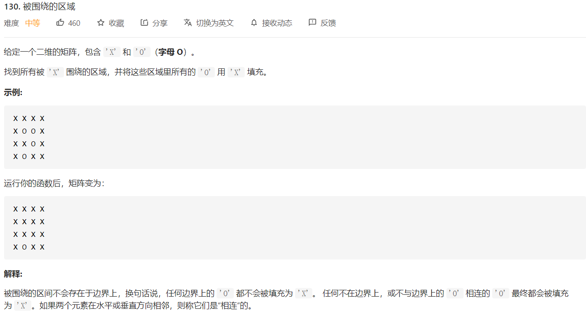

### 一些认识

图的广度优先搜索可以看作是树的先序遍历，先处理当前节点，然后将当前节点的状态加到总的状态中，再传递给后序的节点。

图的深度优先搜索可以看作是树的后序遍历，先处理子节点，当遍历完所有的子节点以后，再根据子节点的返回值判断当前应该做的事情。

### 深度优先DFS+回溯

##### [Leetcode-216. 组合总和 III](https://leetcode-cn.com/problems/combination-sum-iii/submissions/)

难度：⭐⭐

自己完成程度：稍微花了一点时间完成

本题不难，我分别实现了广度优先搜索和深度优先搜索两种方法

【BFS】：

```c++
class Solution {
private:
    vector<vector<int>> res;
public:
    void bfs(int be, int end, int k, int n, int len, vector<int> path){
        for(int i = be; i <= end; i++){
            vector<int> newPath = path;
            int l = i + len;
            if(l == n && (int)newPath.size() == k-1) {
                newPath.push_back(i);
                res.push_back(newPath);
            }
            else if(l < n && (int)newPath.size() < k-1){
                newPath.push_back(i);
                bfs(i+1, end, k, n, len+i, newPath);
            }
        }
    }

    vector<vector<int>> combinationSum3(int k, int n) {
        vector<int> path;
        bfs(1, 9, k, n, 0, path);
        return res;
    }
};
```

我认为BFS比起DFS更加直观一些，因为它不存在回溯，只需要想好当前问题的子问题的初始条件，就可以递归下去。它的问题也很明显，像这种需要记录所经过路径的问题，BFS每到一个新的分支，就需要将当前的结果复制一下传到下一层，时间和空间的花费较高。

【DFS】：

```c++
class Solution{
private:
    vector<vector<int>> res;
    const int Begin = 1;
    const int End = 9;
public:
    void dfs(int be, int sum, int k, int n, vector<int>& path){
        for(int i = be; i <= End; i++){
            path.push_back(i);
            if(sum + i < n && path.size() < k) dfs(i+1, sum+i, k, n, path);
            if(sum + i == n && path.size() == k) res.push_back(path);
            path.pop_back();
        }
    }

    vector<vector<int>> combinationSum3(int k, int n) {
        vector<int> path;
        dfs(Begin, 0, k, n, path);
        return res;
    }
};
```

DFS如果能够想清楚的话，思路也是较为简洁的。DFS的思路便是，先沿着一条路径遍历下去，直到这个路径遍历完，或者找到了一个解，然后再返回上一分支，再开始下一次遍历。

这里在dfs一开始，就先将下一分支的情况加入到路径中。假如这一分支暂时符合要求，就让它继续做dfs；如果这一分支不符合要求，就再将其从路径中弹出；如果这一分支恰好就是问题的解，就将当前的路径结果保存，并将当前分支弹出。

这里dfs的参数是 &path，也就是说，只需要在初始状态申请这样的一个path vector，就可以在遍历和回溯的过程中一直使用。极大地缩减了空间复杂度。

本身函数的递归就是不断压栈和出栈的过程，这里使用&path刚好借助了函数的压栈出栈实现了回溯。

##### [Leetcode-131. 分割回文串](https://leetcode-cn.com/problems/palindrome-partitioning/)

【1】这个题，一上来我用的暴力递归来做的，代码如下：

```c++
class Solution {
public:
    bool is_palindromic(string s, int start, int end){
        for(int i = 0; i < (end - start + 1) / 2; i++){
            if(s[start+i] != s[end-i]) return false;
        }
        return true;
    }
    vector<vector<string>> partition(string s) {
        vector<vector<string>> ans;
        if(s.size() == 0){
            vector<string> temp;
            ans.push_back(temp);
            return ans;
        }
        for(int i = 1; i <= (int) s.size(); i++){
            if(is_palindromic(s, 0, i-1)){
                vector<vector<string>> temp = partition(s.substr(i));
                for(auto t : temp){
                    vector<string> temptemp;
                    // cout << s.substr(0, i) << endl;
                    temptemp.push_back(s.substr(0, i));
                    for(auto str : t) 
                        temptemp.push_back(str);
                    ans.push_back(temptemp);
                }
            }
        }
        return ans;
    }
};
```

【2】看了题解，才想到使用深度优先递归加回溯来做。好久没做递归+回溯了，都有点生疏了：

```c++
class Solution {
private:
    vector<vector<string>> ans;
public:
    // 判断是否是回文
    bool is_palindromic(string &s, int start, int end){
        for(int i = 0; i < (end - start + 1) / 2; i++){
            if(s[start+i] != s[end-i]) return false;
        }
        return true;
    }
    void func(string &s, int start, int end, vector<string> &temp){
        if(is_palindromic(s, start, end)){
            string substr = s.substr(start, end-start+1);
            temp.push_back(substr);
            if(end + 1 == s.size())     // 说明到了字符串末尾
                ans.push_back(temp);
            else
                for(int i = end + 1; i < s.size(); i++)
                    func(s, end+1, i, temp);
            temp.pop_back();
        }
    }
    vector<vector<string>> partition(string s) {
        vector<string> temp;
        if(s.size() == 0)
            ans.push_back(temp);
        else
            for(int i = 0; i < s.size(); i++)
                func(s, 0, i, temp);
        return ans;
    }
};
```

【3】想到可能会有一些重复计算的字符段，如果计算过便保存下来，可能会快一些。于是设计了一个双层哈希来存储，结果效果并不明显。可能重复计算带来时间复杂度的增加，不简简单单是某一种情况的重复计算，而是虽然情况不同，但是所含区域的重复计算。所以这个问题解决了，也并没有带来时间复杂度的提升。

【4】看到题解里有，先利用动态规划，计算得到所有的回文串，也可以降低时间复杂度。

##### 补充题目：

[Leetcode-37. 解数独 ](https://leetcode-cn.com/problems/sudoku-solver)

[Leetcode-47. 全排列 II ](https://leetcode-cn.com/problems/permutations-ii/)

[Leetcode-51. N 皇后 ](https://leetcode-cn.com/problems/n-queens/)

[Leetcode-77. 组合 ](https://leetcode-cn.com/problems/combinations/)

[Leetcode-216. 组合总和 III ](https://leetcode-cn.com/problems/combination-sum-iii/)

[Leetcode-377. 组合总和 Ⅳ ](https://leetcode-cn.com/problems/combination-sum-iv/)


### 递归求解不同的二叉搜索树

##### [Leetcode-95.不同的二叉搜索树](https://leetcode-cn.com/problems/unique-binary-search-trees-ii/)

本题一直没做出来，看了答案才会做，其实直接用暴力递归就可以了，因为题目中也说了，n最大不超过8。

```c++
class Solution {
public:
    vector<TreeNode*> func(int begin, int end){
        vector<TreeNode*> res;
        if(begin > end) {
            res.push_back(nullptr);
            return res;
        }
        for(int i = begin; i <= end; i++){
            vector<TreeNode*> ltree, rtree;
            ltree = func(begin, i-1);
            rtree = func(i+1, end);
            for(auto l : ltree){
                for(auto r : rtree){
                    TreeNode* temp = new TreeNode(i);
                    temp->left = l;
                    temp->right = r;
                    res.push_back(temp);
                }
            }
        }
        return res;
    }
    vector<TreeNode*> generateTrees(int n) {
        if(n == 0){
            vector<TreeNode*> res;
            return res;
        }
        return func(1, n);
    }
};

/*
之前一直不想直接递归，想着做一下遍历+回溯，但是一直没有思路
看了官方题解，还是直接用递归来做。
*/
```


### 广度优先搜索

##### [Leetcode-130. 被围绕的区域](https://leetcode-cn.com/problems/surrounded-regions/)



本题最初我的思路是，将这个问题看成是矩阵的一圈一圈的遍历过程，知道了外层的情况以后，从而确定内层有哪些O与外层的O相连。但是发现问题是更新不同步的问题。于是看了一下提示改用广度优先搜索的方法，利用队列实现。

```c++
struct Point{
    int x;
    int y;
};

class Solution {
public:
    void solve(vector<vector<char>>& board) {
        int rows = board.size();
        if(rows == 0) return;
        int cols = board[0].size();
        queue<Point> q;
        for(int i = 0; i < rows; i++){
            if(board[i][0] == 'O') {
                board[i][0] = '1';
                q.push({i, 0});
            }
            if(cols-1 > 0 && board[i][cols-1] == 'O'){
                board[i][cols-1] = '1';
                q.push({i, cols-1});
            }
        }
        for(int i = 0; i < cols; i++){
            if(board[0][i] == 'O'){
                board[0][i] = '1';
                q.push({0, i});
            }
            if(rows-1 > 0 && board[rows-1][i] == 'O'){
                board[rows-1][i] = '1';
                q.push({rows-1, i});
            }
        }
        // 开始广度优先遍历
        while(!q.empty()){
            Point p = q.front();
            q.pop();
            // 上
            if(p.x >= 1 && board[p.x-1][p.y] == 'O'){
                board[p.x-1][p.y] = '1';
                q.push({p.x-1, p.y});
            }
            // 下
            if(p.x + 1< rows && board[p.x+1][p.y] == 'O'){
                board[p.x+1][p.y] = '1';
                q.push({p.x+1, p.y});
            }
            // 左
            if(p.y >= 1 && board[p.x][p.y-1] == 'O'){
                board[p.x][p.y-1] = '1';
                q.push({p.x, p.y-1});
            }
            // 右
            if(p.y + 1 < cols && board[p.x][p.y+1] == 'O'){
                board[p.x][p.y+1] = '1';
                q.push({p.x, p.y+1});
            }
        }
        for(int i = 0; i < rows; i++){
            for(int j = 0; j < cols; j++){
                if(board[i][j] == 'O') board[i][j] = 'X';
                else if(board[i][j] == '1') board[i][j] = 'O';
            }
        }
    }
};
```


### Dijkstra算法

##### [Leetcode-743. 网络延迟时间](https://leetcode-cn.com/problems/network-delay-time/)

假设一个图中有n个节点和m条边，则使用dijstra算法解决**单源最短路径**问题的时间复杂度是 $O(n^2)$，如果使用堆进行优化，则需要的时间复杂度是$O(mlogm)$。下面使用的是堆优化的dijkstra算法。

```c++
class Solution {
private:
    struct my_greater{
        bool operator()(const pair<int, int> &a, const pair<int, int> &b){
            return a.second > b.second;
        }
    };
public:
    int networkDelayTime(vector<vector<int>>& times, int n, int k) {
        // pair.first 目标点的编号
        // pair.seconde 该边上的传递时间
        vector<vector<pair<int,int>>> edges(n+1, vector<pair<int,int>>());
        for(auto t : times){
            edges[t[0]].push_back(make_pair(t[1], t[2]));
        }
        // 计算迪杰斯特拉最短路径
        vector<int> diji (n+1, INT_MAX);
        vector<bool> visited (n+1, false);	// 记录是否访问过，防止回头
        diji[0] = INT_MIN;
        int count = 0;
        // pair.first: 节点编号（从1开始
        // pair.seconde: 距离
        priority_queue<pair<int, int>, vector<pair<int, int>>, my_greater> pq;
        pq.push(make_pair(k, 0));
        while(count < n && !pq.empty()){
            pair<int, int> p = pq.top();
            pq.pop();
            int node = p.first;
            if(p.second == INT_MAX) break;
            if(!visited[node]){
                visited[node] = true;
                diji[node] = p.second;
                count++;
                vector<pair<int, int>> sub_edges = edges[node];
                for(auto e : sub_edges){
                    if(!visited[e.first]){
                        pq.push(make_pair(e.first, e.second + p.second));
                    }
                }
            }
        }
        int ans = INT_MIN;
        for(int d : diji){
            if(d > ans) ans = d;
        }
        if(ans == INT_MAX) return -1;
        else return ans;
    }
};
```


### 拓扑排序

##### [Leetcode-207. 课程表](https://leetcode-cn.com/problems/course-schedule/)

本题做法就是拓扑排序，每次找到当前入度为0的点，并将其从图上移除，直到没有入度为0的点。

具体实现可以采用栈或者队列，用栈便是深度优先，用队列则是广度优先。

```c++
class Solution {
public:
    bool canFinish(int numCourses, vector<vector<int>>& prerequisites) {
        vector<vector<int>> nextCourse (numCourses, vector<int>());
        vector<unordered_set<int>> aheadCourse (numCourses, unordered_set<int>());
        for(auto p : prerequisites){
            int n1 = p[0], n2 = p[1];
            nextCourse[n2].push_back(n1);
            aheadCourse[n1].insert(n2);
        }
        int ct = 0;
        queue<int> q;
        for(int i = 0; i < numCourses; i++){
            if(aheadCourse[i].size() == 0){
                q.push(i);
            }
        }
        while(q.size() > 0){
            int node = q.front();
            q.pop();
            ct++;
            for(int next_node : nextCourse[node]){
                auto ite = aheadCourse[next_node].find(node);
                aheadCourse[next_node].erase(ite);
                if(aheadCourse[next_node].size() == 0) q.push(next_node);
            }
        }
        return ct == numCourses;
    }
};
```


##### [Leetcode-210. 课程表 II](https://leetcode-cn.com/problems/course-schedule-ii/)

### 其他

##### [Leetcode-117.填充每个节点的下一个右侧节点指针](https://leetcode-cn.com/problems/populating-next-right-pointers-in-each-node-ii/)

本题如果使用二叉树的层次遍历，在每一层上连接next指针，是比较容易解决的，但是题目进阶的要求是时间复杂度为O(1)。题解中给出了一个符合该要求的方法：

>一旦在某层的节点之间建立了 next指针，那这层节点实际上形成了一个链表。因此，如果先去建立某一层的next 指针，再去遍历这一层，就无需再使用队列了。
>
>基于该想法，提出降低空间复杂度的思路：如果第 i 层节点之间已经建立next 指针，就可以通过 next 指针访问该层的所有节点，同时对于每个第 i 层的节点，我们又可以通过它的left 和 right 指针知道其第 i+1 层的孩子节点是什么，所以遍历过程中就能够按顺序为第i+1 层节点建立next 指针。
>

```c++
class Solution {
public:
    Node* connect(Node* root) {
        Node* ptr = root, *front = root;
        while(front != nullptr){
            // 确定下一行的起点
            front = nullptr;
            while(ptr != nullptr && front == nullptr){
                if(ptr->left != nullptr) front = ptr->left;
                else front = ptr->right;
                if(front == nullptr) ptr = ptr->next;
            } 
            // 用next来连接下一行
            Node * temp = nullptr;
            while(ptr != nullptr){
                queue<Node*> q;
                if(ptr->left != nullptr) q.push(ptr->left);
                if(ptr->right != nullptr) q.push(ptr->right);
                while(!q.empty()){
                    if(temp == nullptr) temp = q.front();
                    else{
                        temp->next = q.front();
                        temp = q.front();
                    }
                    q.pop();
                }
                ptr = ptr->next;
            }
            // 进入下一行
            ptr = front;
        }
        return root;
    }
};
```

