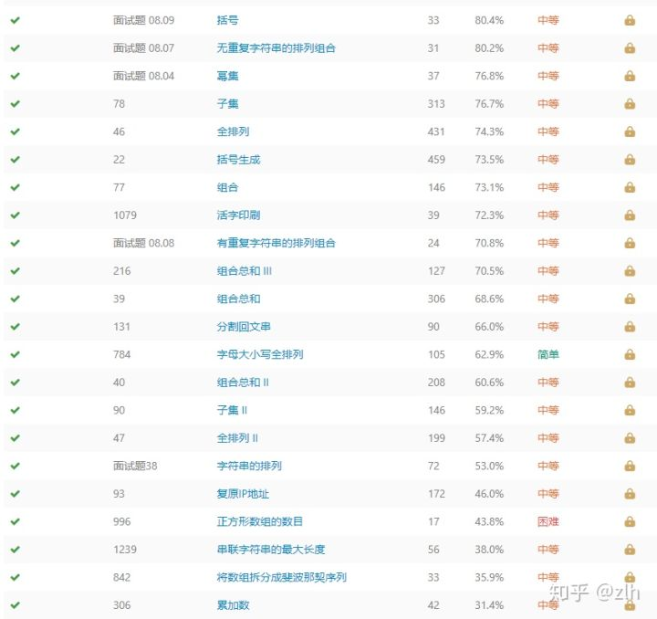

# 回溯法套路模板

原地址：[回溯法套路模板 刷通leetcode - 知乎 (zhihu.com)](https://zhuanlan.zhihu.com/p/112926891)

## 介绍

这几天在学算法，刷leetcode，刷到了“回溯法”tag。

众所周知，回溯法的基本原理就是**递归**，找到当前可行的步骤，然后递归探测后续步骤。

回溯法的题目大体看上去都非常死板，对于这种死题型，最好是有一种**通式**，能让我们一看到问题，就能思考出方法，并且快速写出代码。

刷题过程中也参考了一些大神的刷题思路和总结，其中最有用的是这一篇[[1\]](https://zhuanlan.zhihu.com/p/112926891#ref_1)，他给出来了一个从头到尾的思考路径，但是还是没有给出最pure的套路。

本文也就是“功利性的”给出回溯法的**最快编码方案**。（**注一**：避免误会，“最快”是指能在最短时间内写出逻辑通顺的回溯法代码，目的是成功解题，不是运行时间最快。）（**注二**：实际上这些套路，在一些经典书籍《算法导论》《算法》里面都可以提炼出来，如果能有时间去深入学算法，当然还是建议系统的学书，而不是功利性的为了解题。）

## 直接给出设计思路

1. **全局变量**： 保存结果
2. **参数设计**： 递归函数的参数，是将上一次操作的合法状态当作下一次操作的初始位置。这里的参数，我理解为两种参数：**状态变量**和**条件变量**。（1）状态变量（state）就是最后结果（result）要保存的值；（2）条件变量就是决定搜索是否完毕或者合法的值。
3. **完成条件**： 完成条件是决定 状态变量和条件变量 在取什么值时可以判定整个搜索流程结束。搜索流程结束有两种含义： **搜索成功**并保存结果 和 **搜索失败**并返回上一次状态。
4. **递归过程**： 传递当前状态给下一次递归进行搜索。

## 套路模板

```python3
res = []    # 定义全局变量保存最终结果
state = []  # 定义状态变量保存当前状态
p,q,r       # 定义条件变量（一般条件变量就是题目直接给的参数）
def back(状态，条件1，条件2，……):
    if # 不满足合法条件（可以说是剪枝）
        return
    elif # 状态满足最终要求
        res.append(state)   # 加入结果
        return 
    # 主要递归过程，一般是带有 循环体 或者 条件体
    for # 满足执行条件
    if  # 满足执行条件
        back(状态，条件1，条件2，……)
back(状态，条件1，条件2，……)
return res
```

## 使用回溯法的明显标志

\1. 排列、组合（子集、幂集、字符全排列）。 在传值时，对于排列问题，是要删掉单个用过的元素；组合问题，是删掉前面所有的元素。

\2. 数组、字符串，给定一个特定的规则，尝试搜索迭代找到某个解。

\3. 二维数组下的DFS搜索（八皇后、黄金矿工、数独）

## 如何使用？

模板给出来了，怎么去使用呢？

为了验证模板确实有用，我在Leetcode首先筛选出“回溯法”tag，然后按通过率从高到低（即，困难度从低到高），选择性的选出通过率从80%到30%的题目，使用模板成功解答。

文末还有，**如何优化时间复杂度以应对复杂问题**。



这里挑出其中的几道题进行分析。（常见的八皇后、数独这种经典题目网上有许多题解，已经做烂了，没有分析价值。）

## 题号 题目名 通过率 代码网页

**131 分割回文串 66.6% [力扣](https://link.zhihu.com/?target=https%3A//leetcode-cn.com/problems/palindrome-partitioning/solution/python-76-by-zestloveheart/)**

**题目**：给定一个字符串 s，将 s 分割成一些子串，使每个子串都是回文串。返回 **s 所有可能的分割方案**。

四步：全局变量、参数设计、完成条件、递归过程。

1. 全局变量：该题目要找到可分割的方案，最终结果形式上是：[[],[],[],...]
2. 参数设计：（1）状态变量：当前是回文的字符串（2）条件变量：剩余待搜索的字符串，当字符串长度为0，则搜索完毕。
3. 完成条件：剩余字符串长度为0。
4. 递归过程：在剩余字符串中遍历，如果该串为回文 就 进入下次递归，如果非回文 就 继续搜索下一个串。

```text
class Solution:
    def partition(self, s: str) -> List[List[str]]:
        res = []    # 定义全局变量保存最终结果
        state = []  # 定义状态变量保存当前状态
        def check_str(i):  # 检查字符串列表是否为回文
            if i != i[::-1]:
                return False
            return True
        def back(state,s): 
            if len(s) == 0:# 状态满足最终要求
                res.append([i for i in state])   # 加入结果
                return
            # 主要递归过程，一般是带有 循环体 或者 条件体
            for i in range(0,len(s)):
                if check_str(s[:i+1]):
                    # python的状态传递写法，列表 state+[xxx]，字符串 state+"xxx"
                    back(state+[s[:i+1]],s[i+1:])
        back(state,s)
        return res
```

## 40 组合总数II 60.6% [力扣](https://link.zhihu.com/?target=https%3A//leetcode-cn.com/problems/combination-sum-ii/solution/python-74-hui-su-jian-zhi-by-zestloveheart/)

**题目**：给定一个数组 candidates 和一个目标数 target ，**找出 candidates 中所有可以使数字和为 target 的组合**。candidates 中的每个数字在每个组合中只能使用一次。

四步：

1. 全局变量：res = []
2. 参数设计：（1）状态变量：当前选用过的数字（2）条件变量：剩余的备选数字 和 当前数字的总和。
3. 完成条件：当数字总和等于target了，就加入到res；当大于target了，则不再搜索；当小于target了，就继续搜索。
4. 递归过程：如果当前总和小于target就继续搜索。

```text
class Solution:
    def combinationSum2(self, candidates: List[int], target: int) -> List[List[int]]:
        res = []
        state = []
        s = set()
        def back(state,p,count):
            for i in range(p,len(candidates)):
                temp_count = count+candidates[i]
                temp_state = state + [candidates[i]]
                if temp_count<target:
                    back(temp_state,i+1,temp_count)
                else:
                    if temp_count == target and tuple(temp_state) not in s:
                        s.add(tuple(temp_state))
                        res.append(temp_state)
                    return                
        candidates.sort()
        back(state,0,0)
        return res
```

## 90 子集II 59.2% [力扣](https://link.zhihu.com/?target=https%3A//leetcode-cn.com/problems/subsets-ii/solution/python-88-by-zestloveheart/)

**题目**：给定一个可能包含重复元素的整数数组 nums，**返回该数组所有可能的子集**（幂集）。解集不能包含重复的子集。

1. 全局变量：res = []
2. 参数设计：（1）状态变量：当前组成的子集（2）条件变量：剩余的备选数字。
3. 完成条件：当前状态没有被选过，就加入到res；被选过，就停止搜索。
4. 递归过程：加入当前元素进入下一次递归。

```text
class Solution:
    def subsetsWithDup(self, nums: List[int]) -> List[List[int]]:
        res = []    # 定义全局变量保存最终结果
        state = []  # 定义状态变量保存当前状态
        s = set()       # 定义条件变量（一般条件变量就是题目直接给的参数）
        def back(state,q): 
            if tuple(state) in s:# 不满足合法条件（可以说是剪枝）
                return
            else:# 状态满足最终要求
                s.add(tuple(state))
                res.append([i for i in state])   # 加入结果
            # 主要递归过程，一般是带有 循环体 或者 条件体
            for i in range(q,len(nums)): 
                back(state+[nums[i]],i+1)
        nums.sort()
        back(state,0)
        return res
```

## 面试题38 字符串的排列 53.2% [力扣](https://link.zhihu.com/?target=https%3A//leetcode-cn.com/problems/zi-fu-chuan-de-pai-lie-lcof/solution/python-by-zestloveheart-2/)

**题目**：输入一个字符串，**打印出该字符串中字符的所有排列**。你可以以任意顺序返回这个字符串数组，但里面不能有重复元素。

1. 全局变量：res = []
2. 参数设计：（1）状态变量：当前组成的字符排列（2）条件变量：剩余的备选字符。
3. 完成条件：当前状态没有被组成，就加入到res；被组成过，就停止搜索。
4. 递归过程：加入当前元素进入下一次递归。

```text
class Solution:
    def permutation(self, s: str) -> List[str]:
        res = []    # 定义全局变量保存最终结果
        state = ""  # 定义状态变量保存当前状态
        exist = set()       # 定义条件变量（一般条件变量就是题目直接给的参数）
        def back(state,s):
            if state in exist:# 不满足合法条件（可以说是剪枝）
                return
            elif len(s)==0:# 状态满足最终要求
                res.append(state)   # 加入结果
                exist.add(state)
                return 
            # 主要递归过程，一般是带有 循环体 或者 条件体
            for i in range(len(s)): # 满足执行条件
                back(state+s[i],s[:i]+s[i+1:])
        back(state,s)
        return res
```

## 93 复原IP地址 46.0% [力扣](https://link.zhihu.com/?target=https%3A//leetcode-cn.com/problems/restore-ip-addresses/solution/python-by-zestloveheart-3/)

**题目**：给定一个只包含数字的字符串，复原它并**返回所有可能的 IP 地址格式**。

1. 全局变量：res = []
2. 参数设计：（1）状态变量：当前组成的IP分割形式（2）条件变量：剩余字符 和 已组成的IP节个数。
3. 完成条件：如果剩余的字符不能拼成一个IP，则返回；如果没有剩余字符，就加入到res。
4. 递归过程：当前 字符 为一个合法IP节，则加入当前元素进入下一次递归。

```text
class Solution:
    def restoreIpAddresses(self, s: str) -> List[str]:
        res = []    # 定义全局变量保存最终结果
        state = []  # 定义状态变量保存当前状态
        deep = 0       # 定义条件变量（一般条件变量就是题目直接给的参数）
        def back(state,q,deep):
            if len(s)-q < 1*(4-deep) or len(s)-q > 3*(4-deep): # 不满足合法条件（可以说是剪枝）
                return
            elif len(s)==q:# 状态满足最终要求
                res.append(".".join([str(i) for i in state]))   # 加入结果
                return 
            # 主要递归过程，一般是带有 循环体 或者 条件体
            for i in range(q,q+3):# 满足执行条件
                temp_num = int(s[q:i+1])
                if len(str(temp_num))!= i-q+1:
                    return
                if 0 <= int(s[q:i+1]) <=255:
                    back(state+[temp_num],i+1,deep+1)
        back(state,0,deep)
        return res
```

## 996 正方形数组的数目 43.8% [力扣](https://link.zhihu.com/?target=https%3A//leetcode-cn.com/problems/number-of-squareful-arrays/solution/python-by-zestloveheart-4/)

**题目**：给定一个非负整数数组 A，如果该数组每对相邻元素之和是一个完全平方数，则称这一数组为正方形数组。**返回 A 的正方形排列的数目**。两个排列 A1 和 A2 不同的充要条件是存在某个索引 i，使得 A1[i] != A2[i]。

1. 全局变量：res = [0]，因为这里是要数目，不需要结果，所以只需要一个具体数字。但是如果直接定义为 res = 0，这是一个局部变量，内部是无法引用到的。所以用一个列表包住该数字。
2. 参数设计：（1）状态变量：当前已经组好的正方形数组（2）条件变量：剩余数组。
3. 完成条件：如果剩余数组为空，res数量增加1 。
4. 递归过程：如果当前数字能加入到已经组好的数组中，并使其成为正方形数组，则添加，进入下次递归。

```text
import math
class Solution:
    def numSquarefulPerms(self, A: List[int]) -> int:
        res = [0]    # 定义全局变量保存最终结果
        state = []  # 定义状态变量保存当前状态
        s = set()
        def is_square(square_num):
            if int(math.sqrt(square_num))**2 == square_num:
                return True
            return False
        def back(state,A):
            if tuple(state) in s:
                return
            s.add(tuple(state))
            if len(A)==0:# 状态满足最终要求
                res[0] += 1
                return 
            # 主要递归过程，一般是带有 循环体 或者 条件体
            for i in range(len(A)):# 满足执行条件
                if len(state) == 0 or is_square(state[-1] + A[i]):
                    back(state+[A[i]],A[:i]+A[i+1:])
        back(state,A)
        return res[0]
```

## 1239 串联字符串的最大长度 37.9% [力扣](https://link.zhihu.com/?target=https%3A//leetcode-cn.com/problems/maximum-length-of-a-concatenated-string-with-unique-characters/solution/python3-by-zestloveheart/)

**题目**：给定一个字符串数组 arr，字符串 s 是将 arr 某一子序列字符串连接所得的字符串，如果 s 中的每一个字符都只出现过一次，那么它**就是一个可行解。请返回所有可行解 s 中最长长度**。

1. 全局变量：res = [0]，这里是要最长长度，不需要字符串组成结果
2. 参数设计：（1）状态变量：已经使用的字符串（2）条件变量：剩余的字符串。
3. 完成条件：如果当前的长度大于已搜到的最大长度，则更新res 。
4. 递归过程：当前字符串和已有字符串没有重复元素，则进入下次递归。

```text
class Solution:
    def maxLength(self, arr: List[str]) -> int:
        res = [0]    # 定义全局变量保存最终结果
        state = set()  # 定义状态变量保存当前状态
        arr = [set(i) for i in arr if len(i)==len(set(i))]
        def back(state,q):
            if len(state)>res[0]:# 状态满足最终要求
                res[0] = len(state)
            # 主要递归过程，一般是带有 循环体 或者 条件体
            for i in range(q,len(arr)):# 满足执行条件
                if len(state)+len(arr[i]) == len(state|arr[i]):
                    back(state|arr[i],i+1)
        back(state,0)
        return res[0]
```

## 306 累加数 31.4% [力扣](https://link.zhihu.com/?target=https%3A//leetcode-cn.com/problems/additive-number/solution/python-97-by-zestloveheart/)

题目：累加数是一个字符串，组成它的数字可以形成累加序列。一个有效的累加序列必须至少包含 3 个数。除了最开始的两个数以外，字符串中的其他数都等于它之前两个数相加的和。给定一个只包含数字 '0'-'9' 的字符串，编写一个算法来**判断给定输入是否是累加数**。累加序列里的数不会以 0 开头，所以不会出现 1, 2, 03 或者 1, 02, 3 的情况。

1. 全局变量：res = [False]，这里是要能否形成累加数，所以是 bool 变量。
2. 参数设计：（1）状态变量：前2个已经组成的数字（2）条件变量：剩余的字符串 和 已经组成的数字个数。
3. 完成条件：如果当前的长度大于2，并且没有剩余字符串，则更新res 。
4. 递归过程：当前的数字不以0开头 或者 深度小于2 或者 前面两数之和等于第三数，则进入下次递归。

```text
class Solution:
    def isAdditiveNumber(self, num: str) -> bool:
        res = [False]    # 定义全局变量保存最终结果
        a,b,q,deep = 0,0,0,0   # 定义状态变量保存当前状态
        def back(a,b,q,deep):
            if deep>=3 and len(num)==q: # 状态满足最终要求
                res[0] = True
                return 
            # 主要递归过程，一般是带有 循环体 或者 条件体
            i = q
            while i < len(num):
                temp_num = num[q:i+1]
                if len(str(int(temp_num))) != len(temp_num):
                    return
                temp_num = int(temp_num)
                if deep<2 or a+b==temp_num:
                    back(b,temp_num,i+1,deep+1)
                if res[0] or (a!=0 and a+b<temp_num):
                    return
                i+=1
        back(a,b,0,deep)
        return res[0]
```

至此，就将通过率60%-30%的题目都简单的分析了，并用模板解了一遍。

那么问题来了，刷通不是我们的最高境界，只是一个入门阶段，最快才是最高要求，如何对回溯法进行优化让算法更快呢？

## 四个加速通道让回溯如虎添翼

### 一、传递数组下标而不是整个剩余数组

在上面解的大多数题里面，都会传递一个待选数组。比如：子集中，待选元素[1,2,3]；字符串中，待选元素"bcde"；合法IP中，"2252123123"。

最直观的是，每次传递一个剩余解给下一次递归做初始状态。每次都会在内存中new一个新的列表或者字符串，显然会增加资源消耗。

但是，如果直接传下标，就可以不用新建对象。

比如：子集中，[1,2,3,4]，搜[2,3,4]，就传下标1；字符串中，"bcde"，搜"de"，就传下标2。

这是最简单的优化方法。

### 二、剪枝

剪枝实际上就是利用我们已知的先验条件，将后面不可能完成任务目标的搜索路径去掉。

比如：

合法IP中，假如我们已经组成了"1.2.3"，现在备选串还有"2345"，我们只剩下一节，而备选长度为4，是如何都不能组成合法串的，这种分支就可以剪。

累加数中，我们已经搜得[1,2,3,5,8]，剩下只有"x"，剩余总长为1，就不可能满足5+8=13的长度2；或者剩下了"39xxxx"，我们探测39时，发现5+8小于39，而后续的数字随着位数增大，值必然也增大，那后续的39x，39xx也不可能是5+8的解。

这种剪枝就是，在当前情况下，我们的先验条件就已经判定出，不可能完成最终任务目标。

另外还有一种剪枝，也可以说是复用，剪去已经遇到的分支。

假如我们在前面的递归中，已经求得了某个**状态S**的解，我们可以将其保存在数组A中。在后续的并列分支中，如果又遇到了这个**状态S**，就可以去数组A中查，而不用重新求。

### 三、构建图

该思路是利用已知条件，将题目给出来的数组中的数据建立联系，构建出一个有向图或者无向图，回溯法就可以转化为一个对图的DFS搜索，极大的缩小了解空间。

典型的题目是：[正方形数组的数目](https://link.zhihu.com/?target=https%3A//leetcode-cn.com/problems/number-of-squareful-arrays/)

比如要对 [1,17,8] 搜索正方形数组。先建立一个图，让其中可以组成正方形数的两个数字给一条边连接，这样就会组成 1-8-17 的图，对该图寻找哈密顿路径即可。

还有 [单词接龙 II](https://link.zhihu.com/?target=https%3A//leetcode-cn.com/problems/word-ladder-ii/)

可以对单词表中可以互相接龙的词语进行连接，然后进行最短路径搜索即可。

### 四、回溯法转构造法

在一些问题中，用回溯法可能很难写剪枝规则的条件，这时可以将该问题转化为构造问题。

回溯法是用剪枝来去掉后续不可能出现的路径；构造法是一步一步的构造出可行路径。进而得到最终解。也可以理解为，构造法就是回溯法DFS的BFS过程。

最典型的例子是构造排列问题。给定 [1,2,3]，求其全排列。

**构造法**的过程是，把可行解拼出来：

第一次构建：{1，2，3}

第二次构建：{12，13，21，23，31，32}

第三次构建：{123，132，213，231，312，321}

对比**回溯法**来看：

1[23] ----- 12[3] ----- 123 ----- 13[2] ----- 132

2[13] ----- 21[3] ----- 213 ----- 23[1] ----- 231

3[12] ----- 31[2] ----- 312 ----- 32[1] ----- 321

## 结语

回溯法的初级入门模板和改进手段都已经列了出来，核心还是要多刷多练找题目的共性。将多个手段结合起来使用才能融会贯通。

## 题解

131 分割回文串 66.6% [力扣](https://link.zhihu.com/?target=https%3A//leetcode-cn.com/problems/palindrome-partitioning/solution/python-76-by-zestloveheart/)

40 组合总数II 60.6% [力扣](https://link.zhihu.com/?target=https%3A//leetcode-cn.com/problems/combination-sum-ii/solution/python-74-hui-su-jian-zhi-by-zestloveheart/)

90 子集II 59.2% [力扣](https://link.zhihu.com/?target=https%3A//leetcode-cn.com/problems/subsets-ii/solution/python-88-by-zestloveheart/)

47 全排列 57.3% [力扣](https://link.zhihu.com/?target=https%3A//leetcode-cn.com/problems/permutations-ii/solution/python-by-zestloveheart/)

面试题38 字符串的排列 53.2% [力扣](https://link.zhihu.com/?target=https%3A//leetcode-cn.com/problems/zi-fu-chuan-de-pai-lie-lcof/solution/python-by-zestloveheart-2/)

93 复原IP地址 46.0% [力扣](https://link.zhihu.com/?target=https%3A//leetcode-cn.com/problems/restore-ip-addresses/solution/python-by-zestloveheart-3/)

996 正方形数组的数目 43.8% [力扣](https://link.zhihu.com/?target=https%3A//leetcode-cn.com/problems/number-of-squareful-arrays/solution/python-by-zestloveheart-4/)

1239 串联字符串的最大长度 37.9% [力扣](https://link.zhihu.com/?target=https%3A//leetcode-cn.com/problems/maximum-length-of-a-concatenated-string-with-unique-characters/solution/python3-by-zestloveheart/)

306 累加数 31.4% [力扣](https://link.zhihu.com/?target=https%3A//leetcode-cn.com/problems/additive-number/solution/python-97-by-zestloveheart/)

## 参考

1. [^](https://zhuanlan.zhihu.com/p/112926891#ref_1_0)程小新同学：LeetCode--回溯法心得 https://zhuanlan.zhihu.com/p/51882471