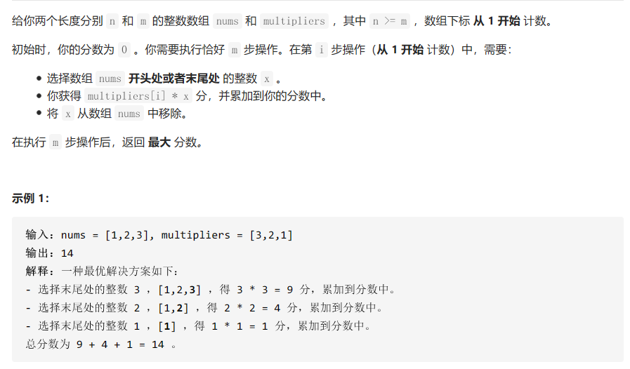

### 一些认识

递归本质上就是一种穷举，动态规划可以消除其中一些需要重复计算的子问题。所以从递归演进到动态规划一般是：递归 -> 递归+备忘录 -> 动态规划。一般来说，递归+备忘录的方法与动态规划的时间复杂度是相同的。

能用动态规划的条件就是，这个递归问题存在**最优子结构**，而且存在**重复子问题**，这时候只需要找出**状态转移方程**就可以求解动态规划问题。所以，最优子结构、重复子问题和状态转移方程也被称为动态规划问题的三要素。

回溯算法也是一种穷举，它通过适时地剪枝来节省运行时间。一般来说，如果一个递归的问题，要求最优解的大小，不需要知道得到最优解的路径，一般是使用动态规划便可以解决。而一些求最优的路径的时候，使用动态规划不能解决，这个时候需要用到回溯算法。

### DP数组滚动更新，经典的空间压缩

##### [牛客网-程序员代码面试指南-矩阵的最小路径和-CD186]([矩阵的最小路径和_牛客网 (nowcoder.com)](https://www.nowcoder.com/practice/2fb62a4500af4f4ba5686c891eaad4a9?tpId=101&&tqId=33254&rp=1&ru=/ta/programmer-code-interview-guide&qru=/ta/programmer-code-interview-guide/question-ranking))

【难度】：⭐⭐

【自己解决的程度】：独立解决

本题不难，需要注意的点主要是通过滚动更新，将dp数组从O(m*n)压缩为O(min(m, n))。这一设计显著降低了空间复杂度，也减少了一次寻址的次数，从而也能提高运行速度。但因为滚动更新的时候，是覆盖之前的值，这就使得求解轨迹变得不可回溯。

```c++
int main(void){
    int n, m;
    cin >> n >> m;
    cin.get(); 	// 别忘了吃掉这个回车

    // 数据读入
    vector<vector<int>> matrix(n, vector<int>(m));

    for(int i = 0; i < n; i++) for(int j = 0; j < m; j++) cin >> matrix[i][j];
    //开始计算
    // 这里dp只有两行的原因是，这里的结果只与上一行的值有关
    vector<int> dp (m, 0);
    for(int i = 0; i < n; i++){
        for(int j = 0; j < m; j++){
            if(i == 0 && j == 0) dp[j] = matrix[i][j];
            else if(i == 0 && j != 0)
                dp[j] = dp[j-1] + matrix[i][j];
            else if(i != 0 && j == 0)
                dp[j] = dp[j] + matrix[i][j];
            else dp[j] = min(dp[j], dp[j-1]) + matrix[i][j];
        }
    }
    cout << dp[m-1];
    return 0;
}
```


### 斐波那契数列

##### [牛客网-程序员代码面试指南-斐波那契数列问题的递归和动态规划-CD183]([斐波那契数列问题的递归和动态规划_牛客网 (nowcoder.com)](https://www.nowcoder.com/practice/376282a6682a4005973cde7b3df69584?tpId=101&&tqId=33251&rp=1&ru=/ta/programmer-code-interview-guide&qru=/ta/programmer-code-interview-guide/question-ranking))

【难度】：⭐⭐⭐⭐

【自己解决程度】：自己找到了与解答不同思路的解法

这个题使用暴力求解的话，时间复杂度为O(2^n)，如果使用动态规划求解的话，时间复杂度为O(n)。那么有没有时间复杂度为O(logn)的方法？书上解答给出了一种时间复杂度为O(logn)的方法，我自己想到了一种解决方法。先来看我想到的方法：

```c++
/*
 * 这个题要找到时间复杂度为 O(logn)的方法
 * 看到 O(logn)，自然想到的就是如何在每次计算的时候，都能将后续计算的规模缩小1(n)倍。
 *
 * 斐波那契数列的递推关系式展开，有
 * fn = f(n-1) + f(n-2)
 *    = 2f(n-2) + f(n-3)
 *    = 3f(n-3) + 2f(n-4)
 * 观察到，后面两项的系数，也都符合斐波那契数列
 * 那是不是有这样的一个规律：
 * 如果n为偶数：
 * fn = f(4)f(n-3) + f(3)f(n-4)
 *    = ...
 *    = f(n/2)f(n/2+1) + f(n/2-1)f(n/2)
 * 如果n为奇数：
 * fn = f(4)f(n-3) + f(3)f(n-4)
 *    = ...
 *    = f(n/2+1)f(n/2+1) + f(n/2)f(n/2)
 * 这样就成功地将所需要的时间缩小了一倍，中间f(n-1)到f(n/2+1)的值为多少我们都不关心了。
 */

```

代码如下：

```c++
const int Module = 1000000007;
unordered_map <long long, int> myhash;

int fib(long long n){
    int arr [8] = {0, 1, 1, 2, 3, 5, 8, 13};
    if(n < 8) return arr[(int)n];
    if(myhash.find(n) != myhash.end()) return myhash[n];

    long long temp;
    if(n % 2 == 0) temp = fib(n/2)*(long long)(fib(n/2+1) + fib(n/2-1));
    else temp = (long long)fib(n/2+1)*fib(n/2+1) + (long long)fib(n/2)*fib(n/2);
    myhash[n] = (int)(temp % Module);
    return (int)(temp % Module);
}

int main(void){
    // 读入数据
    long long n;
    cin >> n;
    cout << fib(n);
    return 0;
}
```

书上的方法则更加具有普适性：

因为`f(n) = f(n-1) + f(n-2)`，所以，可以得到

```
(f(n), f(n-1)) = (f(n-1),f(n-2))*(1, 1)
								 (1, 0)
```

初始状态`(f(2),f(1)) = (1, 1)`，那么从初始状态求到n状态只需要做n-2变换，也就是乘上这个矩阵的`n-2`次方。而求矩阵的平方的时间复杂度是O(logn)，比如，求16次方就可以写成两个8次方的乘积；求19次方，因为二进制是`10011`，所以知道变换矩阵的16次方、2次方和1次方，便能求出。

下面的一个该题的变形，就用到了上面刚刚说到的方法。

##### [牛客网-程序员代码面试指南-斐波那契数列问题的递归和动态规划3-CD186]([斐波那契数列问题的递归和动态规划3_牛客网 (nowcoder.com)](https://www.nowcoder.com/practice/e2696bb900ce41cda8b060768e61f796?tpId=101&&tqId=33253&rp=1&ru=/ta/programmer-code-interview-guide&qru=/ta/programmer-code-interview-guide/question-ranking))

【难度】：⭐⭐⭐⭐

【自己解决程度】：看完上题书中的的解法，也找到了本题的变换矩阵

本题与上题一样，也是要找到两次相邻状态之间的变换矩阵，思考过程如下：

```c++
/*
 * 本题参考的是书上对斐波那契数列问题的解决方法
 * 即找到两种状态之间转换的转换矩阵，然后通过矩阵乘法来求解
 *          成熟母牛    三岁母牛    两岁母牛    一岁母牛
 * 初始 n0:    1           0          0          0
 *   ...
 *      ni:    a           b          c          d
 *    ni+1:   a+b          c          d         a+b
 *   ...
 * 从状态ni到状态ni+1的矩阵变换是：
 * (a, b, c, d)(  1  0  0  1 ) = (a+b, c, d, a+b)
 *             (  1  0  0  1 )
 *             (  0  1  0  0 )
 *             (  0  0  1  0 )
 * 只需要求这个n次方，然后乘上初始向量，就可以得到最终的向量\
 *
 * 本题需要自己写一个矩阵乘法
 */
```

代码还需自己实现矩阵的乘法与矩阵的乘方，代码如下：

```c++
const int Module = 1000000007;

long long transMatrix [4][4] = {  1, 0, 0, 1,
                                  1, 0, 0, 1,
                                  0, 1, 0, 0,
                                  0, 0, 1, 0 };

long long beginState [4][4] =  {  1, 0, 0, 0,
                                  0, 0, 0, 0,
                                  0, 0, 0, 0,
                                  0, 0, 0, 0 };

// 矩阵乘法，矩阵m1乘上矩阵m2
long long** MatrixMulti(long long ** m1, long long ** m2, int len){
    long long** result = new long long* [len];
    for(int i = 0; i < len; i++){
        result[i] = new long long [len];
    }

    for(int i = 0; i < len; i++){
        for(int j = 0; j < len; j++){
            long long temp = 0;
            for(int k = 0; k < len; k++){
                temp += m1[i][k] * m2[k][j];
                temp %= Module;
            }
            // 这里求一个余数，保证最后得到的结果都是在int范围内
            result[i][j] = temp % Module;
        }
    }
    return result;
}

// 矩阵乘方
long long** MatrixPower(long long n, long long ** matrix, int len){
    // 先将result初始化为一个E矩阵
    long long** result = new long long* [len];
    for(int i = 0; i < len; i++){
        result[i] = new long long [len];
        for(int j = 0; j < len; j++){
            if(i == j) result[i][j] = 1;
            else result[i][j] = 0;
        }
    }
    // 然后把n转二进制
    vector<int> bN;
    // 二进制低位在数组头
    // 即 bN[0] 对应的是 2^0，bN[1]对应的是2^1
    while(n > 0){
        bN.push_back(n % 2);
        n = n / 2;
    }
    for(int i = 0; i < bN.size(); i++){
        if(bN[i] == 1) result = MatrixMulti(result, matrix, len);
        matrix = MatrixMulti(matrix, matrix, len);
    }
    return result;
}

int main(void){
    // 读入数据
    long long n;
    cin >> n;

    // 初始化变换矩阵
    int length = 4;
    long long ** transform = new long long* [length];
    for(int i = 0; i < length; i++){
        transform[i] = transMatrix[i];
    }
    // 初始化初始状态
    long long ** state = new long long* [length];
    for(int i = 0; i < length; i++){
        state[i] = beginState[i];
    }

    transform = MatrixPower(n-1, transform, length);
    state = MatrixMulti(state, transform, length);

    auto ans = (long long)(state[0][0] + state[0][1] + state[0][2] + state[0][3]);
    cout << (int)(ans % Module);

    return 0;
}
```

### 一些经典的动态规划题

##### [牛客网-程序员代码面试指南-换钱的方法数-CD19]([换钱的方法数_牛客网 (nowcoder.com)](https://www.nowcoder.com/practice/39cb6c6e2b844a8cba382c8e26951e0a?tpId=101&&tqId=33087&rp=1&ru=/ta/programmer-code-interview-guide&qru=/ta/programmer-code-interview-guide/question-ranking))⭐⭐

【难度】：⭐⭐

【自己解决程度】：看了一下题解说要列一张N*aim大小的表之后才有思路

这个题是做动态规划题目以来遇到的最难的一道题目，个人感觉应该是⭐⭐⭐的难度。

**"这道题的经典之处在于，它可以体现暴力递归、记忆搜索和动态规划之间的关系，并可以在动态规划的基础上进行再一次优化"**

【时间复杂度O(N*aim)但是错误的方法】

我一开始想到的方法是题目[牛客网-程序员代码面试指南-换钱的最少货币数-CD12]([换钱的最少货币数_牛客网 (nowcoder.com)](https://www.nowcoder.com/practice/4e05294fc5aa4d4fa8eacef2e606e5a8?tpId=101&&tqId=33080&rp=1&ru=/ta/programmer-code-interview-guide&qru=/ta/programmer-code-interview-guide/question-ranking))中给出的方法，这里使用这一方法来做，会难以消除重复解的问题。比如：货币的面值为1、3、5，想要找到面值之和为8的货币，我的这个算法可能会将先拿3再拿5凑齐8元 与 先拿5再拿3凑齐8元视为是同一种情况。

【时间复杂度O(N\*aim\*aim)的方法】

可以依次换，比如，现在有面值为a、b、c的货币。然后先把能用a换到的数额都置为1，之后就不再关心面值为a的钱了，然后以每个数字开始i，就可以求 b的倍数 nb，dp[i+nb]++。对于面值为c的钱也是同样。

【时间复杂度O(N*aim)的方法】

需要使用一张大小为N*aim的表来记录上述过程：

**例如：**现在手里有面值为1、3、5的货币，想要求有几种方法可以得到8元。

- 详细表格：

  |      | 0    | 1    | 2    | 3    | 4             | 5               | 6                         | 7                                     | 8                                  |
  | ---- | ---- | ---- | ---- | ---- | ------------- | --------------- | ------------------------- | ------------------------------------- | ---------------------------------- |
  | 1    |      | 1x1  | 2x1  | 3x1  | 4x1     1x3+1 | 5x1     1x3+2x1 | 6x1     1x3+3x1     1x5+1 | 7x1     1x3+4x1     1x5+2x1     2x3+1 | 8x1      1x3+5x1     1x5+3x1     2x3+2x1 |
  | 3    |      |      |      | 1x3  |               |                 | 2x3                       |                                       | 1x5+3                              |
  | 5    |      |      |      |      |               | 1x5             |                           |                                       |                                    |

  列表示对应货币的面值，行表示当前的金额。可以看到，维持一种增加货币的顺序，就可以保证不出现重复的情况。

- 对上表进行化简：

  |      | 0    | 1    | 2    | 3    | 4    | 5    | 6    | 7    | 8    |
  | ---- | ---- | ---- | ---- | ---- | ---- | ---- | ---- | ---- | ---- |
  | 1    | 0    | 1    | 1    | 1    | 2    | 2    | 3    | 4    | 4    |
  | 3    | 0    | 0    | 0    | 1    | 0    | 0    | 1    | 0    | 1    |
  | 5    | 0    | 0    | 0    | 0    | 0    | 1    | 0    | 0    | 0    |

  在数额为`i`处新增一张货币`j`，就把`dp[i-j][j]~dp[i-j][n]`的数额都加到`dp[i][j]`上。这样便维持上面所说的顺序。但这里将`dp[i-j][j]~dp[i-j][n]`加到`dp[i][j]`之上的这一过程，要花费O(n)的时间复杂度，总的时间复杂度为O(n\*n\*aim)。说明还可以继续改进。

- 优化时间复杂度：

  上面可以看到，只需在`dp[i][j]`能够知道`dp[i][j]~dp[i][n]`的和就可以了，这个不难做到，只需要在给dp赋值的时候，记录一个累加值，从而避免了每次枚举再累加。

  |          | 0    | 1    | 2    | 3    | 4    | 5    | 6    | 7    | 8    |
  | -------- | ---- | ---- | ---- | ---- | ---- | ---- | ---- | ---- | ---- |
  | arr[0]=1 | 0    | 1    | 1    | 2    | 2    | 3    | 4    | 4    | 5    |
  | arr[1]=3 | 0    | 0    | 0    | 1    | 0    | 1    | 1    | 0    | 1    |
  | arr[2]=5 | 0    | 0    | 0    | 0    | 0    | 1    | 0    | 0    | 0    |

  `dp[i][j]`中放的是`dp[i][j]~dp[i][n]`的解的总数。`dp[i][j]-dp[i][j+1]`才是真正的这个位置新得到的解的个数。

代码如下：

```c++
const int Module = 1000000007;

int main(void){
    // 读入数据
    int n, aim;
    cin >> n >> aim;
    cin.get();

    vector<int> arr(n);
    for(int i = 0; i < n; i++){
        cin >> arr[i];
    }
    // 开始计算
    // 用一个大小为 n x aim 的二维数组来存储
    vector<vector<int>> dp (aim+1, vector<int>(n, 0));

    for(int i = 0; i <= aim; i++){
        int sum = 0;
        for(int j = n-1; j >= 0; j--){
            int delta = i - arr[j];
            if(delta == 0) sum += 1;
            else if(delta > 0){
                sum += dp[delta][j];
                sum %= Module;
            }
            dp[i][j] = sum;
        }
    }
    cout << dp[aim][0];
    return 0;
}
```

【书上的解法】

书上的解法总体上与我的优化思路相似，但是给出了一些更加宏观的认识。

书上指出**记忆搜索方法在本质上等价于动态规划方法，两者都是用空间换时间**，记忆搜索方法还是使用的递归，只是将一些已经计算过的解记录了下来，避免了重复计算。而动态规划则是规定好每一个递归过程的计算顺序，依次进行计算，后面的计算过程严格依赖前面计算的过程。

而且书上的方法是容易进行空间压缩的，而我的方法则不容易做到。


##### [牛客网-程序员面试代码指南-打气球的最大分数-CD20]([打气球的最大分数_牛客网 (nowcoder.com)](https://www.nowcoder.com/practice/35119064d0224c35ab1ab612bffee8df?tpId=101&&tqId=33088&rp=1&ru=/ta/programmer-code-interview-guide&qru=/ta/programmer-code-interview-guide/question-ranking))⭐⭐⭐

【难度】：⭐⭐⭐

【自己完成程度】：没有思路，跟着书上的解法完成


```c++
int main(void){
    // 读入数据
    int n;
    cin >> n;
    cin.get();

    vector<int> arr(n);
    for(int i = 0; i < n; i++){
        cin >> arr[i];
    }

    // 开始计算
    // 新构建的帮助数组，前后分别填充 1以方便计算
    vector<int> help;
    help.push_back(1);
    for(int a : arr) help.push_back(a);
    help.push_back(1);
    // 构建的一个dp矩阵，大小为 (n+2)x(n+2)，初始化为全 0
    // dp[l][r]表示，当 l-1 和 r+1 都没有被打爆的时候，打爆 [l,r]之间的所有的气球的得分
    vector<vector<int>> dp (n+2, vector<int>(n+2, 0));
    // 沿一列列对角线循环求解
    for(int i = 0; i < n; i++){
        for(int l = 1; l <= n-i; l++){
            int r = l + i;
            if(i == 0) dp[l][r] = help[l-1]*help[l]*help[l+1];
            else{
                vector<int> temp;   // 暂存可能解，用来找最优解
                // 假设第 k个球最后被打爆
                for(int k = l; k <= r; k++) {
                    int val = dp[l][k - 1] + help[l - 1] * help[k] * help[r + 1] + dp[k + 1][r];
                    temp.push_back(val);
                }
                dp[l][r] = *max_element(temp.begin(), temp.end());
            }
        }
    }

    cout << dp[1][n];

    return 0;
}
```

【小结】：


### 0-1背包问题

##### [Leetcode 416.分割等和子集]([416. 分割等和子集 - 力扣（LeetCode） (leetcode-cn.com)](https://leetcode-cn.com/problems/partition-equal-subset-sum/))

```c++
// 本题是一道典型的0-1背包问题，0-1背包问题是一个NP完全问题
// 可以这样来思考，我们要找到两个子集的元素和相等，就相当于找到一个子集，它的元素和为总的元素和的一半
// 这就转化成一个0-1背包问题，已知背包的容量，每个物品只有一个，只能选择拿与不拿
// 问如何拿取物品刚好填满这个背包

class Solution {
public:
    bool canPartition(vector<int>& nums) {
        int sum = 0;
        for(int n : nums) sum += n;
        
        // 先解决一些显而易见的情况
        if(sum % 2 == 1) return false;

        // 开始计算
        int target = sum / 2;
        vector<int> dp (target + 1, 0);
        // base case
        dp[0] = 1;
        // other case
        for(int num : nums){
            vector <int> vec;
            for(int i = 0; i <= target; i++){
                if(dp[i] == 1 && i + num <= target){
                    if(i+num == target) return true;
                    else vec.push_back(i+num);
                }
            }
            // 这里需要等前面计算完了再更新
            // 或者也可以将上面的i，改为从target遍历到0，这样就能保证更新顺序
            for(int v : vec) dp[v] = 1;
        }
        return false;
    }
};
```

这个题可以这样来考虑，在`[1,n]` 区间内是否可以取出一个子数组，使得它们的和为target，我们可以记为 `f(1, n, target)` ，当`f`值为`1`的时候，表示存在这样的一个子数组，当`f`值为`0`的时候，表示不存在这样的一个子数组。那么，`f(1, n, target) = max{f(1, n-1, target), f(1, n-1, target-arr[n])}`，即，如果不取元素`arr[n]`（元素从1开始编号），加和已经为target的话，则就不取。如果不取，得不到，但是取了`arr[n]`加和为`target`，也算得到。其他情况均不算能得到。

那么我们其实不关心前面到底取了谁没取谁，只关心当前轮到第`i`个元素的时候，它的取和不取，会给当前的情况带来那些新的总和。


##### [Leetcode 518.零钱兑换 II]([518. 零钱兑换 II - 力扣（LeetCode） (leetcode-cn.com)](https://leetcode-cn.com/problems/coin-change-2/))

我的解法，与牛客网换钱的方法数CD19其实是同一个题。

```c++
class Solution {
public:
    int change(int amount, vector<int>& coins) {
        int n = coins.size();
        if(amount == 0) return 1;
        if(n == 0) return 0;
        vector<vector<int>> dp (n, vector<int>(amount+1, 0));

        // sort(coins.begin(), coins.end());
        // base case:
        // 这里的base case有问题，因为dp[j][i]被我设置为一个累加值
        // 所以既不能全为1，也不能累加，所以就直接在循环体中做累加1这一操作了
        
        // other case:
        for(int i = 1; i <= amount; i++){
            // dp[j][i]中存的是一个累计值，累计dp[j][i]到dp[n-1][i]
            int a = 0;
            for(int j = n-1; j >= 0; j--){
                int delta = i - coins[j];
                if(delta == 0) a += 1;
                else if(delta > 0) a += dp[j][delta];
                dp[j][i] = a;
            }
        }
        return dp[0][amount];
    }
};
```

[labuladong]([经典动态规划：完全背包问题 (qq.com)](https://mp.weixin.qq.com/s?__biz=MzAxODQxMDM0Mw==&mid=2247485124&idx=1&sn=52068c8000b90a7a972dbd04658d79b7&chksm=9bd7f8ccaca071da66d3c9e567ab49b27c711db154c2f297f55fcd7c3c1156afa37b0ad60555&scene=21#wechat_redirect)) 给出的另外一种更好的方法，而且可以对时间复杂度进行压缩：

```c++
// 另外的一种更直观的做法
// 用dp[i][j] 表示，只使用coins[0]到coins[i]，来得到数额j
class Solution {
public:
    int change(int amount, vector<int>& coins){
        int n = coins.size();
        if(amount == 0) return 1;
        if(n == 0) return 0;
        vector<vector<int>> dp (n+1, vector<int>(amount+1, 0));

        // base case:
        for(int i = 0; i < n; i++) dp[i][0] = 1;

        // post case:
        for(int i = 0; i < n; i++){
            for(int j = 1; j <= amount; j++){
                int delta1 = 0, delta2 = 0;
                if(j - coins[i] >= 0) delta1 = dp[i][j-coins[i]];
                if(i-1 >= 0) delta2 = dp[i-1][j];
                dp[i][j] = delta1 + delta2;
            }
        }

        return dp[n-1][amount];
    }
};
```


##### [Leetcode 474.一和零]([Loading Question... - 力扣（LeetCode） (leetcode-cn.com)](https://leetcode-cn.com/problems/ones-and-zeroes/))

```c++
// 0-1背包问题
// 每个元素只有取和不取两种情况
// 依次考虑strs中的元素
// 无论是取还是不取，都是在之前所有的状态下，增加自己的这个状态
// dp的大小为[strs.size()][m]
class Solution {
public:
    int findMaxForm(vector<string>& strs, int m, int n) {
        int len = strs.size();
        vector<int> help (len+1, 0);
        vector<vector<int>> dp (len+1, vector<int>(m+1, -1));
        
        // base case:
        help[0] = 1;
        dp[0][0] = 0;
        
        // other case:
        for(int i = 0; i < len; i++){
            // cout << "i=" << i << ", ";
            int zeroCt = 0, oneCt = 0;
            for(char c : strs[i]){
                if(c == '0') zeroCt++;
                else oneCt++;
            }
            for(int j = i; j >= 0; j--){
                if(help[j] == 1){
                    for(int k = 0; k <= m; k++){
                        if(dp[j][k] == -1) continue;
                        int zeroCtNew = zeroCt + k;
                        int oneCtNew = oneCt + dp[j][k];
                        if(zeroCtNew <= m && oneCtNew <= n &&
                                (dp[j+1][zeroCtNew] == -1 
                                 || dp[j+1][zeroCtNew] > oneCtNew)){
                            dp[j+1][zeroCtNew] = oneCtNew;
                            help[j+1] = 1;
                        }
                    }
                }
            }
        }
        // 返回结果
        int res = 0;
        for(int j = 0; j <= len; j++)  if(help[j] == 1) res = j;
        return res;
    }
};
```

### 其他的动态规划题

##### [Leetcode-1770. 执行乘法运算的最大分数](https://leetcode-cn.com/problems/maximum-score-from-performing-multiplication-operations/submissions/)



本题是一道周赛题，当时在做的时候，没有想出来思路。本题如果直接使用暴力方法递归求解的话，每次都可以从`nums`的前面或者后面选取一个与`multipliers`的一个数字相乘，就会有两条分支，所以，总的时间复杂度为 $2^{m-1}$ 这个数量级，显然会超时。考虑使用动态规划来求解，

```c++
class Solution {
public:
    int maximumScore(vector<int>& nums, vector<int>& multipliers) {
        int m = multipliers.size(), n = nums.size();
        int result = INT_MIN;
        vector<vector<int>> dp (m, vector<int>(m, 0));
        for(int i = 0; i < m; i++){
            for(int j = 0; j < m; j++){
                if(i == 0 && j == 0) continue;
                else if(i == 0){
                    dp[i][j] = dp[i][j-1] + multipliers[i+j-1]*nums[n-j];
                }
                else if(j == 0){
                    dp[i][j] = dp[i-1][j] + multipliers[i+j-1]*nums[i-1];
                }
                else{
                    int a = dp[i-1][j] + multipliers[i+j-1]*nums[i-1];
                    int b = dp[i][j-1] + multipliers[i+j-1]*nums[n-j];
                    dp[i][j] = max(a, b);
                }
                if(i+j == m){
                    if(dp[i][j] > result) result = dp[i][j];
                    break;
                }
            }
        }
        return result;
    }
};
```


