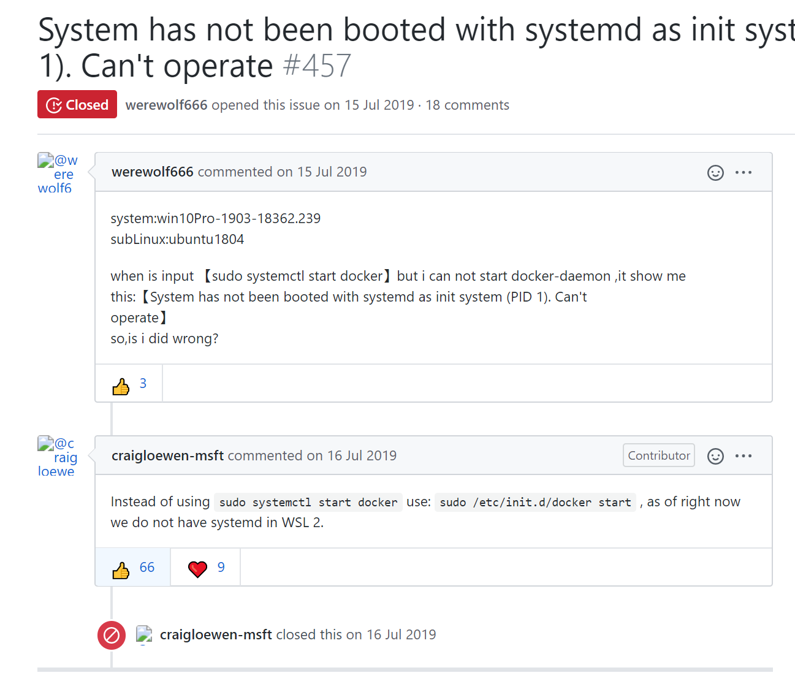

## Win10 Home 版安装docker

Win10 家庭版 2004 版本以后拥有了WSL2 可以使用Docker了。

在我这里无论是Win10 Home 还是 Win10 Pro，Docker都与VMware存在冲突。

有的时候会遇到：

> Hardware assisted virtualization and data execution protection must be enabled in the BIOS. See https://docs.docker.com/docker-for-windows/troubleshoot/#virtualization-must-be-enabled

这个问题就是之前安装完VMware解决了它的问题以后给docker的安装造成了问题。

解决方法也很简单，就是在 “Windows 功能” 中，关闭“虚拟机平台”（virtual machine platform），此时电脑会重启。重启以后再开启“虚拟机平台”，又会重启，之后再开启Docker就没有这个问题了。

个人觉得是重装了一下虚拟机的底层支持。因为我之前使用VMware的时候遇到问题，记得通过命令行修改过一些设置。

## 如何在window的UbuntuWSL上玩耍docker？

本人用的是Windows10Home版，版本号2004，刚更新完，支持了WSL2，但是安装完Docker以后发现就不能使用VMware了，于是在Docker与VM中纠结了一下果断选择了VM。

于是想着去到UbuntuWSL上装一下Docker试试，应该是没有问题的。

经过了一番

```
$ sudo apt update
$ sudo apt upgrade
```

把Ubuntu上的软件都更新了一遍，然后便开始安装docker

```
$ sudo apt install docker.io
```

我也很奇怪为啥是docker.io，安装完以后我就去忙别的作业了，直到睡觉前又回来玩耍docker。

这个时候发现一个问题，当我想用docker在Windows的UbuntuWSL上安装Ubuntu的时候：

```
$ docker pull ubuntu
>>> Using default tag: latest
Cannot connect to the Docker daemon at unix:///var/run/docker.sock. Is the docker daemon running?
```

得到上面的返回信息。它告诉我docker没有在运行。

于是我想到开启docker

```
$ service docker start
>>> docker: unrecognized service
```

居然找不到docker这个服务，当时人都傻了，因为此前：

```
$ docker
>>> Usage:  docker [OPTIONS] COMMAND

A self-sufficient runtime for containers

Options:
      --config string      Location of client config files (default "/home/lyr/.docker")
  -c, --context string     Name of the context to use to connect to the daemon (overrides DOCKER_HOST env var and default context set with "docker context use")
  -D, --debug              Enable debug mode
  -H, --host list          Daemon socket(s) to connect to
  -l, --log-level string   Set the logging level ("debug"|"info"|"warn"|"error"|"fatal") (default "info")
      --tls                Use TLS; implied by --tlsverify
      --tlscacert string   Trust certs signed only by this CA (default "/home/lyr/.docker/ca.pem")
      --tlscert string     Path to TLS certificate file (default "/home/lyr/.docker/cert.pem")
      --tlskey string      Path to TLS key file (default "/home/lyr/.docker/key.pem")
      --tlsverify          Use TLS and verify the remote
  -v, --version            Print version information and quit

Management Commands:
  builder     Manage builds
  config      Manage Docker configs
  container   Manage containers
  context     Manage contexts
  engine      Manage the docker engine
  image       Manage images
  network     Manage networks
  node        Manage Swarm nodes
  plugin      Manage plugins
  secret      Manage Docker secrets
  service     Manage services
  stack       Manage Docker stacks
  swarm       Manage Swarm
  system      Manage Docker
  trust       Manage trust on Docker images
  volume      Manage volumes

Commands:
  attach      Attach local standard input, output, and error streams to a running container
  build       Build an image from a Dockerfile
  commit      Create a new image from a container's changes
  cp          Copy files/folders between a container and the local filesystem
  create      Create a new container
  deploy      Deploy a new stack or update an existing stack
  diff        Inspect changes to files or directories on a container's filesystem
  events      Get real time events from the server
  exec        Run a command in a running container
  export      Export a container's filesystem as a tar archive
  history     Show the history of an image
  images      List images
  import      Import the contents from a tarball to create a filesystem image
  info        Display system-wide information
  inspect     Return low-level information on Docker objects
  kill        Kill one or more running containers
  load        Load an image from a tar archive or STDIN
  login       Log in to a Docker registry
  logout      Log out from a Docker registry
  logs        Fetch the logs of a container
  pause       Pause all processes within one or more containers
  port        List port mappings or a specific mapping for the container
  ps          List containers
  pull        Pull an image or a repository from a registry
  push        Push an image or a repository to a registry
  rename      Rename a container
  restart     Restart one or more containers
  rm          Remove one or more containers
  rmi         Remove one or more images
  run         Run a command in a new container
  save        Save one or more images to a tar archive (streamed to STDOUT by default)
  search      Search the Docker Hub for images
  start       Start one or more stopped containers
  stats       Display a live stream of container(s) resource usage statistics
  stop        Stop one or more running containers
  tag         Create a tag TARGET_IMAGE that refers to SOURCE_IMAGE
  top         Display the running processes of a container
  unpause     Unpause all processes within one or more containers
  update      Update configuration of one or more containers
  version     Show the Docker version information
  wait        Block until one or more containers stop, then print their exit codes

Run 'docker COMMAND --help' for more information on a command.
```

这说明不是dockers没有安装好的问题。没办法，只能Google了。

它告诉我是要用下面的命令：

```
$ sudo systemctl start docker
>>> System has not been booted with systemd as init system (PID 1). Can't operate.
```

可以看到仍旧有报错信息。

稍微插一嘴，有一个命令可以看服务的状态：

```
$ service --status-all
>>>  [ - ]  acpid
 [ - ]  apparmor
 [ ? ]  apport
 [ - ]  atd
 [ + ]  cgroupfs-mount
 [ - ]  console-setup.sh
 [ - ]  cron
 [ ? ]  cryptdisks
 [ - ]  cryptdisks-early
 [ - ]  dbus
 [ - ]  docker
 [ - ]  ebtables
 [ ? ]  hwclock.sh
 [ + ]  irqbalance
 [ + ]  iscsid
 [ - ]  keyboard-setup.sh
 [ - ]  kmod
 [ - ]  linuxlogo
 [ - ]  lvm2
 [ + ]  lvm2-lvmetad
 [ + ]  lvm2-lvmpolld
 [ - ]  lxcfs
 [ - ]  lxd
 [ - ]  mdadm
 [ - ]  mdadm-waitidle
 [ + ]  open-iscsi
 [ - ]  open-vm-tools
 [ ? ]  plymouth
 [ ? ]  plymouth-log
 [ - ]  procps
 [ - ]  rsync
 [ - ]  rsyslog
 [ - ]  screen-cleanup
 [ - ]  ssh
 [ ? ]  ubuntu-fan
 [ - ]  udev
 [ - ]  ufw
 [ - ]  unattended-upgrades
 [ - ]  uuidd
 [ - ]  x11-common
```

然后又去Google刚刚的那个报错信息：System has not been booted with systemd as init system (PID 1). Can't operate.

试到了第三种方法的时候，成功了。解决方法来自WSL的官方github：https://github.com/MicrosoftDocs/WSL/issues/457，如下图



我更新完已经支持WSL2了，但是我的UbuntuWSL可能仍旧不支持。于是输入该命令：

```
$ sudo /etc/init.d/docker start
>>>  * Starting Docker: docker
```

可以看到返回信息就非常积极了。

不放心再查看一下运行的服务情况：

