# Deep Learning on Graphs: A Survey

作者：Ziwei Zhang, Peng Cui and Wenwu Zhu, *Fellow, IEEE*

## 摘要

论文将当前图深度学习领域涉及到的方法分为五种，分别是：Graph Recurrent Neural Networks, Graph Convolutional Networks, Graph Autoencoders, Graph Reinforcement Learning, and Graph Adversarial Methods。

## 1 Introduction

将 Deep Learning 引入 Graph 所面临的困难：

- 图结构的不规则
- 图中的异构信息
- 图的规模比较大（从而对算法对时间复杂度的要求比较高
- 图中可能会涉及到多领域的知识

五种Graphs上的深度学习模型的简介：

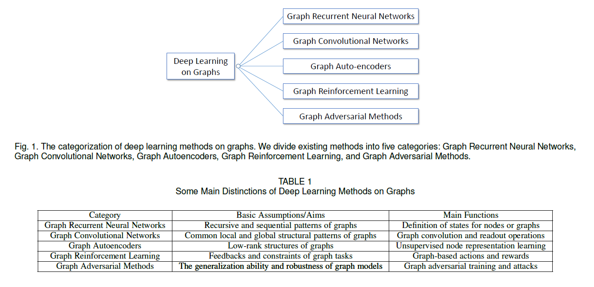

Graph RNNs capture recursive and sequential patterns of graphs by modeling and states in either the node-level or the graph-level. 

GCNs define convolution and read- out operations on irregular graph structures to capture common local and global structural patterns. 

GAEs assume low-rank graph structures and adopt unsupervised methods for node representation learning. 

Graph RL defines graph-based actions and rewards to get feedbacks on graph tasks while following constraints. 

Graph Adversarial Methods adopt adversarial training to enhance the generalization ability of graph models and test their robustness by adversarial attacks.

## 2 Notations & Preliminaries

后面会用到的一些符号表示：

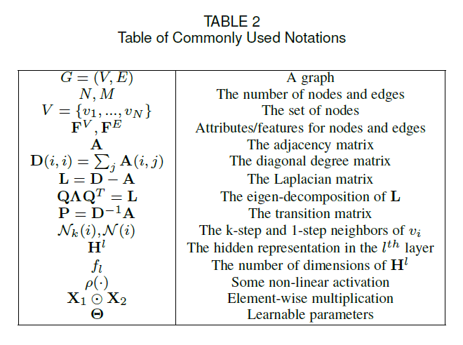

图上的深度模型的学习任务可以大致分成两个部分：

- 专注于节点的任务：the tasks are associated with individual nodes in the graph. Examples include node classification, link prediction, and node recommendation
- 专注于图的任务：the tasks are associated with the whole graph. Examples include graph classification, estimating cer- tain properties of the graph or generating graphs

这种分类更多的是从概念层面，而非数学层面，这两种方法相互之间也存在联系。

##  3 Graph Recurrent Neural Networks

Graph RNNs 可以分为两大类：node-level RNNs 和 graph-level RNNs，具体的如下表所示：

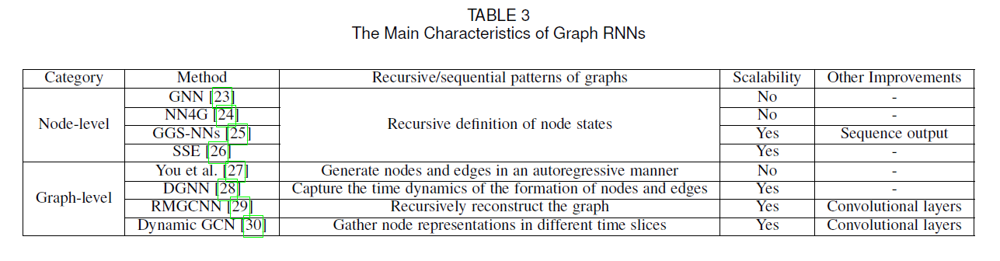

### 3.1 Node-level RNNs

### 3.2 Graph-level RNNs

## 4 Graph Convolutional Networks

与GNNs相关的方法如下表所示：

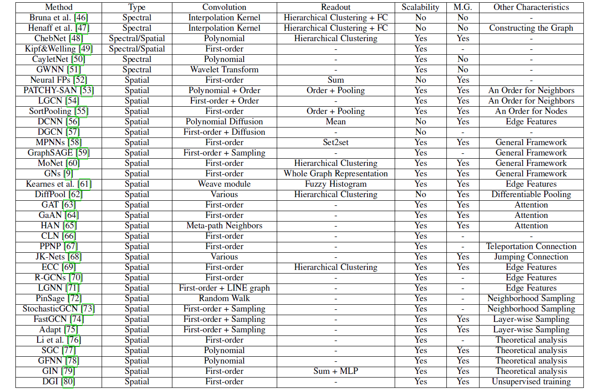

### 4.1 Convolution Operation

> 【补充】
>
> 什么是卷积？主要参考了*知乎@1335*、*知乎@图灵的猫* 的回答
>
> 卷积：
> $$
> W(T) = \int^{+\infin}_{-\infin}h(\tau)f(T-\tau)d\tau
> $$
> 傅里叶变换：
> $$
> F(\omega) = \int_{-\infin}^{+\infin}f(t)e^{-i\omega t}dt, \\
> e^{ix} = cosx+isinx
> $$
> 控制论的中的Laplace变换：
> $$
> F(s) = \int^{+\infin}_0 f(t)e^{-\sigma t}e^{-i\omega t}dt = \int^{+\infin}_0f(t)e^{-st}dt
> $$
> **如何形象地理解卷积**
>
> 下图中的冲击函数$f(t)$刻画了小明吃掉一支冰激凌（吃冰激凌的过程所需要的时间忽略不计）以后的体重的增量$\Delta W$随时间$t$的变化。假设小明一直吃冰激凌，T时刻为当前时刻，$\tau$时刻为吃的某一支冰激凌的时刻，该冰激凌对小明当前体重的影响为$f(T-\tau)$，那么小明T时刻增加的体重为：
> $$
> W(T)=\int^T_0f(T-\tau) = \int^T_0 \frac{1}{d\tau}f(T-\tau)d\tau
> $$
> 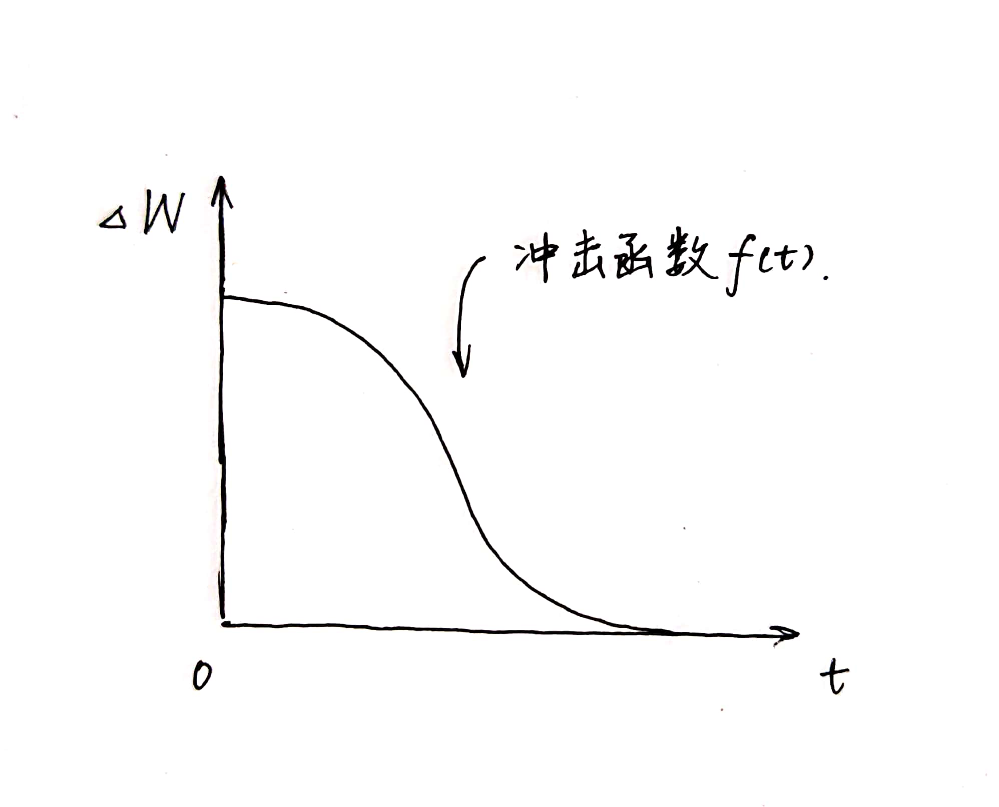
>
> 那么如果小明在某一时刻可以同时吃多支冰激凌呢？
>
> 假设在$\tau$时刻，小明吃了$g(\tau)$个冰激凌：
> $$
> W(T) = \int^T_0\frac{g(\tau)}{d\tau}f(T-\tau)d\tau
> $$
> 其中，$\frac{g(\tau)}{d\tau}$表示吃冰激凌的速度，记为$h(\tau)$，那么：
> $$
> W(T) = \int^T_0h(\tau)f(T-\tau)d\tau
> $$
> 第一个函数$h(·)$表示对象对系统的作用速度，第二个函数$f(·)$表示当前作用速度为单位冲击函数时，这个对象对系统的作用效果。
>
> **通俗地讲**卷积的意义即为：
> $$
> 输出=输入\times系统
> $$
> 这里输入即为上面的$h()$系统为上面的$f()$。对于卷积表达式$h(t)*f(t)=\int^{+\infin}_{-\infin}f(\tau)h(t-\tau)d\tau$，相当于在投影之前，把输入信号r(t)在时间轴上翻转了180°，然后与系统f进行投影。
>
> 在图像领域，有如下图所示：
>
> 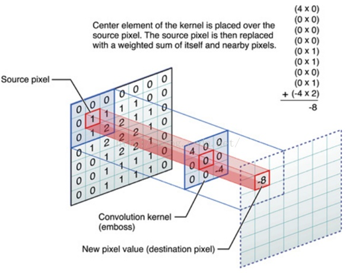
>
> 这里的输入与输出都是一幅图像，系统是一个kernel function或mask。
>
> 其实看到上面的这个mask也可以联想到图像处理领域的Sobel算子、Laplace算子等等。这些算子保留图像中的高频信号，去掉了其中的低频信号。

#### 4.1.1 Spectral Methods

由于Graph没有图片或是音频的那种规范的格栅结构，为了能够对Graph进行卷积运算，这里[^1]类比信号处理中的傅里叶变换，通过使用Graph Laplacian矩阵$L$，给出了Graph（ $*_G$ ）上的卷积操作：

$$
u_1*_G u_2 = Q((Q^T u_1)\odot(Q^T u_2)) \tag{4}
$$
其中$Q$为$L$的特征向量。简单来说，$Q^T$将Graph中的信号$u_1$与$u_2$变换到了谱域（Spectral Domain）中，然后$Q$对乘积的结果再做一次反变换。

对于信号u进行滤波的操作可以通过下式得到：
$$
u' = Q\Theta Q^Tu \tag{5}
$$
这里u'为输出信号，$\Theta=\Theta(\Lambda)\in\R^{N\times N}$是一个对角矩阵结构的可训练的滤波器，这里$\Lambda$是$L$的特征值（所组成的对角阵）。从而，一个卷积隐藏层由 将不同的滤波器一用到不同的输入输出信号中来得到 如下所示：
$$
u_j^{l+1} = \rho(\sum_{i=1}^{f_l}Q\Theta^{l}_{i,j}Q^T u^l_i) \ \ \ j=1,...,f_{l+1} \tag{6}
$$
这里，$l$是层号，$u^l_j\in\R^N$是第$l$曾第$j$个隐含表示，$\Theta_{i,j}^{l}$是滤波器。从而完成对于输入的信息聚合。

公式（3）的问题是时间复杂度比较高，而且，在光谱域的滤波器可能不会定位在空间域。比如，每个节点都会被其他所有的点所影响而不是被一小块区域内的点影响。故提出了如下的平滑滤波器：
$$
diag(\Theta^l_{i,j}) = \mathcal{K}\alpha_{l,i,j},\tag{7}
$$
其中$\mathcal{K}$是一个确定的插值内核，$\alpha_{l,i,j}$是训练得到的插值系数。

但是仍旧时间复杂度较高$O(N^3)$，而且模型的参数决定了，它一但确定下来就不适用于不同大小与结构的Graph，泛化能力弱。

> 【补充】
>
> 对@superbrother 在知乎上的回答 [从CNN到GCN的联系与区别——GCN从入门到精（fang）通（qi）][1] 整理了一下，在这里做一个补充：
>
> （一）Motivation
>
> 因为CNN处理不了Graph上的问题，为了能够将卷积运算迁移到Graph上，提出了两种提取拓扑空间特征的方式：
>
> - vertex domain 
> - spectral domain：研究图信号处理的学者们定义了Graph上的傅里叶变换，进而定义了Graph上的convolution
>   
>
> （二）什么是 Spectral Graph Theory
>
> Spectral Graph Theory 简单来说是，**借助于图的拉普拉斯矩阵的特征值与特征向量来研究图的性质**。
>
> （三）使用Laplacian矩阵的原因：
>
> Laplacian矩阵：$L = D - A$，这里$D$是节点的度的矩阵，$A$是图的邻接矩阵。
>
>  1. Laplacian矩阵是对称阵，可进行特征分解（即谱分解）
>  2. Laplacian矩阵只在中心顶点和一阶相连的顶点上有非0元素
>  3. 通过Laplacian矩阵可以与Laplacian算子做类比（后续会提到）
>
> （四）Laplacian矩阵的谱分解
> $$
> L = U \begin{pmatrix} \lambda_1 & & \\  & ... & \\ & & \lambda_n \end{pmatrix} U^{-1} = U \begin{pmatrix} \lambda_1 & & \\  & ... & \\ & & \lambda_n \end{pmatrix} U^T
> $$
>  其中，$U=(\vec{u_1},\vec{v_2},...,\vec{v_n})$，是列向量为单位向量的矩阵，$\lambda_i$为特征值，$U$为正交矩阵。
>
>  （五）如何从传统的傅里叶变换、卷积类比到Graph上的傅里叶变换与卷积
>
>  - 推广傅里叶变换
>
>    - 广义的特征方程定义为：
>      $$
>      AV=\lambda V
>      $$
>      其中A为一种变换，V为特征向量（或者说是函数），$\lambda$为特征值。
>
>      做拉普拉斯变换，$e^{-iwt}$满足：
>      $$
>      \Delta e^{-i\omega t} = \frac{\part^2}{\part t^2} e^{-i\omega t} = (-i\omega)^2e^{-i\omega t} = -\omega^2e^{-i\omega t}
>      $$
>      这里$e^{-i\omega t}$为$\Delta$的特征函数，$\omega$与特征值密切相关。
>
>    - 传统的傅里叶变换定义为：
>      $$
>      F(\omega) = \mathcal{F}[f(t)] = \int f(t)e^{-i\omega t}dt
>      $$
>      在Graph上的傅里叶变换为：
>      $$
>      F(\lambda_l) = \hat{f}(\lambda_l)=\sum^{N}_{i=1}f(i)u^*_l(i)
>      $$
>      f是graph上的N维向量，f(i)与graph上的顶点一一对应，$u_l(i)$为第$l$个特征向量的第$i$个分量。那么特征值（频率）$\lambda_l$下的，f 的Graph傅里叶就是与$\lambda_l$对应的特征向量$u_l$进行内积运算。$u^*_l(i)$为$u_l(i)$的共轭。
>
>    - 写成矩阵的形式有：
>      $$
>      \begin{pmatrix}\hat{f}(\lambda_1) \\\hat{f}(\lambda_2) \\...\\\hat{f}(\lambda_N)\end{pmatrix} =\begin{pmatrix}u_1(1) & u_1(2) & ... & u_1(N) \\u_2(1) & u_2(2) & ... & u_2(N) \\... \\u_N(1) & u_N(2) & ... & u_N(N)\end{pmatrix}\begin{pmatrix}f(1) \\f(2) \\... \\f(N)\end{pmatrix}
>      $$
>      即 $\hat f = U^T f$
>
>      这里U即为前一节的U
>
>    - 傅里叶逆变换为：$f=U\hat f$
>
>  - 推广卷积
>
>    傅里叶逆变换：
>    $$
>    \mathcal{F}^{-1}[f (\omega) ] = \frac{1}{2\pi} \int \hat f(\omega)e^{i\omega t}d\omega
>    $$
>    卷积定理：函数卷积的傅里叶变换是函数傅里叶变换的乘积，即对于函数$f(t)$与$h(t)$两者的卷积是其函数傅里叶变换乘积的逆变换。
>    $$
>    f*h = \mathcal{F}^{-1}[\hat f (\omega) \hat h (\omega)] = \frac{1}{2\pi} \int \hat f(\omega)\hat h (\omega)e^{i\omega t}d\omega
>    $$
>    类推到graph上，$f$的傅里叶变换为$\hat f = U^T f$，卷积核h的傅里叶变换写成对角阵的形式为：
>    $$
>    \begin{pmatrix}
>    \hat h (\lambda_1) & & \\
>    & ... & \\
> & & \hat h (\lambda_n)
>    \end{pmatrix}
>    $$
>    $\hat{h}\left(\lambda_{l}\right)=\sum_{i=1}^{N} h(i) u_{l}^{*}(i)$是根据需要设计的卷积核h在Graph上的傅里叶变换。
>    
>    两者的傅里叶变换乘积即为：
>    $$
>    \left(\begin{array}{ccc}
>    \hat{h}\left(\lambda_{1}\right) & & \\
>    & \ddots & \\
>    & & \hat{h}\left(\lambda_{n}\right)
>    \end{array}\right) U^{T} f
>    $$
>    再乘以$U$求两者傅里叶变换乘积的逆变换，则求出卷积：
> $$
>    (f*g)_G = U \begin{pmatrix}\hat h (\lambda_1) & & \\ & ... & \\  & & \hat h (\lambda_n)\end{pmatrix} U^Tf
> $$
>    也有一些论文写成是： $(f*h)_G = U((U^Th)\odot(U^Tf))$
> 
>    $\odot$表示Hadamard product（哈达马积），对于两个维度相同的向量、矩阵、张量进行对应位置的逐元素乘积运算。

> 【补充】拉普拉斯矩阵与拉普拉斯算子之间的关系？知乎@superbrother的文章 [拉普拉斯矩阵与拉普拉斯算子的关系][3] 
>
> 

> 【个人小结】
>
> 这里的图卷积应该还是对图中所有的节点一起做卷积，在后面提出的解决效率的问题中，才提出了在一阶邻域或者k阶邻域内做图卷积。
>
> 【陈华伟老师介绍的谱方法存在的问题】
>
> 1. 需要使用拉普拉斯矩阵特征值分解
> 2. 计算复杂度较高
> 3. 在节点域中是非局部的，图中所有的点都对当前节点有影响，而不是节点的邻域

#### 4.1.2 Efficiency Aspect

为了解决计算效率的问题，ChebNet[^2]提出了如下的多项式滤波器：
$$
\Theta(\Lambda) = \sum^{K}_{k=0}\theta_k \Lambda^k, \tag{8}
$$
作者又将公式8中的特征分解改为切比雪夫展开（Chebyshev expansion），如下所示：

$$
\Theta(\Lambda) = \sum^{K}_{k=0}\theta_k \mathcal{T}_k(\tilde{\Lambda}),\tag{9}
$$
这里，$\tilde\Lambda = 2\Lambda/\lambda_{max}-I$是重新调节的特征值，$I$是单位矩阵，$\mathcal{T}_k(x)$是切比雪夫第k个多项式展开。

那么公式5就可以改写为：
$$
u'=Q\Theta(\Lambda)Q^Tu = \sum^{K}_{k=0}\theta_kQ\mathcal{T}_k(\tilde{\Lambda})Q^Tu\\=\sum^{K}_{k=0}\theta_k\mathcal{T}_k(\tilde{L})u=\sum^{K}_{k=0}\theta_k\bar{u}_k,\tag{10}
$$
这里，$\bar{u}_k = \mathcal{T}_k(\tilde{L})u$，$\tilde{L}=2L/\lambda_{max}-I$。使用递归关系的切比雪夫展开式为：$\mathcal{T}_k(x) = 2x\mathcal{T}_{k-1}(x)-\mathcal{T}_{k-2}(x)$并且$\mathcal{T}_0(x)=1,\mathcal{T}_1(x) = x$。$\bar{u}_k$也可以通过递归来计算：
$$
\bar u_k = 2\tilde L \bar u_{k-1} - \bar u_{k-2}\tag{11}
$$
其中$\bar u_0 = u, \bar u_1 = \tilde L u$。

此时，通过使用稀疏矩阵乘法，时间复杂度为$O(KM)$（因为$\tilde L$是一个稀疏矩阵）。这里，M是图中边的数量，K是多项式次方。完成卷积以后，节点$v_i$的表示只与其的K跳范围内的邻居节点相关。

Kipf与Welling[^3]通过只使用一阶邻居，来对ChebNet进行改进
$$
\mathbf{h}_{i}^{l+1}=\rho\left(\sum_{j \in \tilde{\mathcal{N}}(i)} \frac{1}{\sqrt{\tilde{\mathbf{D}}(i, i) \tilde{\mathbf{D}}(j, j)}} \mathbf{h}_{j}^{l} \Theta^{l}\right),\tag{12}
$$
这里，$h_i^l\in\R^{f_l}$是节点$v_i$在第$l$层的隐含表示。用$\tilde{D} = D + I$和$\tilde {\mathcal N}(i) = \mathcal{N}(i)\cup\{i\}$。重写公式12就有：
$$
\mathbf{H}^{l+1}=\rho\left(\tilde{\mathbf{D}}^{-\frac{1}{2}} \tilde{\mathbf{A}} \tilde{\mathbf{D}}^{-\frac{1}{2}} \mathbf{H}^{l} \Theta^{l}\right),\tag{13}
$$
该论文的作者认为，堆叠一定数量的层级以后，能够获得与ChebNet中的模型相似的表示能力，并得到更好的结果。结构如下图所示：

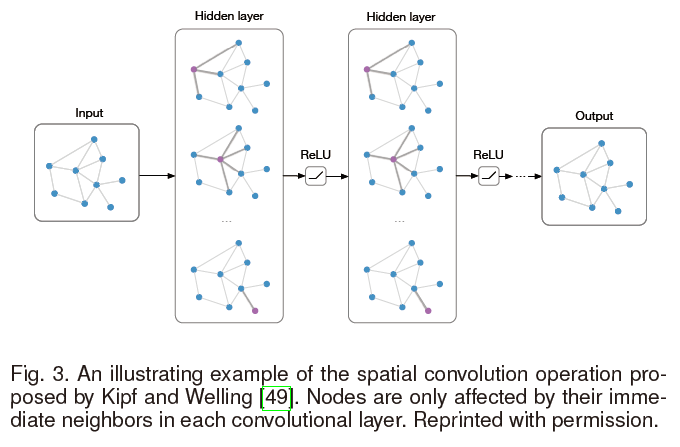

> 这里摘自GCNs的作者Kipf的博客：http://tkipf.github.io/graph-convolutional-networks/
>
> 主要介绍了为什么传播公式（13）中会有一个$D^{-\frac{1}{2}}$。
>
> (A\) is typically not normalized and therefore the multiplication with \(A\) will completely change the scale of the feature vectors (we can understand that by looking at the eigenvalues of \(A\)). Normalizing \(A\) such that all rows sum to one, i.e. \(D^{-1}A\), where \(D\) is the diagonal node degree matrix, gets rid of this problem. Multiplying with \(D^{-1}A\) now corresponds to taking the average of neighboring node features. In practice, dynamics get more interesting when we use a symmetric normalization, i.e. \(D^{-\frac{1}{2}}AD^{-\frac{1}{2}}\) (as this no longer amounts to mere averaging of neighboring nodes).
>
> 其实也可以参考公式12，主要的目的是将邻接矩阵标准化（加和为1），不然会导致特征向量与其相乘以后规模变得不定。

ChebNet与其扩展方法都是将频谱图卷积与空间结构连接起来，通过考虑节点的邻域来定义图的卷积。

为了解决效率的问题，出现了一些纯频谱的方法。就比如CayleyNet[^4]：
$$
\Theta(\Lambda)=\theta_{0}+2 \operatorname{Re}\left\{\sum_{k=1}^{K} \theta_{k}\left(\theta_{h} \Lambda-i \mathbf{I}\right)^{j}\left(\theta_{h} \Lambda+i \mathbf{I}\right)^{j}\right\},\tag{14}
$$

在这里$i=\sqrt{-1}$是复数的虚部，$\theta_h$是另一个频谱放大参数。除了像ChebNet一样高效，作者提出Cayley多项式可以检测“窄频带的重要性”来得到更好的结果。

Graph Wavelet Neural Network（GWNN）[^5]提出了用图小波变换（Graph Wavelet Transform）来取代频谱滤波器中的傅里叶变换。于是对公式4进行了改写：
$$
\mathbf{u}_{1} *_{G} \mathbf{u}_{2}=\psi\left(\left(\psi^{-1} \mathbf{u}_{1}\right) \odot\left(\psi^{-1} \mathbf{u}_{2}\right)\right)
$$
这里$\psi$是图小波基。通过使用快速近似算法来计算$\psi$和$\psi^{-1}$，计算的复杂度依旧是$O(KM)$。

> 【补充】
>
> 小波变换（wavelet transform，WT）是一种新的变换分析方法，它继承和发展了短时傅立叶变换局部化的思想，同时又克服了窗口大小不随频率变化等缺点，能够提供一个随频率改变的“时间-频率”窗口，是进行信号时频分析和处理的理想工具。
>
> **从图像处理的角度看，小波变换存在以下几个优点：**
>
> ⑴小波分解可以覆盖整个频域（提供了一个数学上完备的描述）
>
> ⑵小波变换通过选取合适的滤波器，可以极大的减小或去除所提取得不同特征之间的相关性
>
> ⑶小波变换具有“变焦”特性，在低频段可用高频率分辨率和低时间分辨率（宽分析窗口），在高频段，可用低频率分辨率和高时间分辨率（窄分析窗口）
>
> ⑷小波变换实现上有快速算法（Mallat小波分解算法） 

#### 4.1.3 Multiple Graphs Aspect

有很多方法是将卷积运算推广到任意大小的Graph上。

Nerual FPs[^6]提出了一种空间上的方法，同样使用的是一阶邻接点。
$$
\mathbf{h}_{i}^{l+1}=\sigma\left(\sum_{j \in \hat{\mathcal{N}}(i)} \mathbf{h}_{j}^{l} \Theta^{l}\right),\tag{16}
$$
因为参数$\Theta$与矩阵的大小无关，所以可以迁移到不同的graph上。公式16与公式12很像。与添加正则项来体现不同节点的度的影响有所不同，该方法将对度不同的节点生成不同的$\Theta$。这种方法对较小的Graph效果很高。

PATCHY-SAN[^7]提出了一种不同的方法，它使用图标签的方法例如图同构算法（Weisfeiler-Lehman kernel）来给邻居节点分配唯一的顺序，并使用这种预先定义好的顺序，将节点排成一行。然后指定一个接受域，在k阶邻域内选取固定数量的节点。从而使得不同的图都可以选取出同样确定数量的、相似顺序的节点。

同时该算法也十分依赖这种图标签的方法，但这种预处理方法是不能通过训练学习出来的。

DCNN[^8]提出了另外一种方法，将基于特征的卷积卷积替换为基于扩散的（diffusion-basis），节点的“接受域”则由节点间的扩散变换概率所决定。具体的，卷积由下式给出：
$$
\mathbf{H}^{l+1}=\rho\left(\mathbf{P}^{K} \mathbf{H}^{l} \Theta^{l}\right),\tag{17}
$$
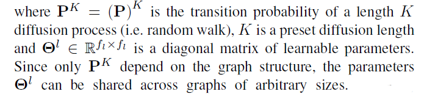

计算$P^K$导致了时间复杂度的增加$O(N^2K)$，从而使得该方法不适用于规模较大的Graph。

DGCN[^9]进一步提出了，利用双图卷积网络联合联合采用基于扩散和邻接的方法。DGCN使用两个卷积，一个如公式13所示，另一个邻接矩阵替换为转移概率的 the positive pointwise mutual information (PPMI) 矩阵：
$$
\mathbf{Z}^{l+1}=\rho\left(\mathbf{D}_{P}^{-\frac{1}{2}} \mathbf{X}_{P} \mathbf{D}_{P}^{-\frac{1}{2}} \mathbf{Z}^{l} \mathbf{\Theta}^{l}\right),\tag{18}
$$
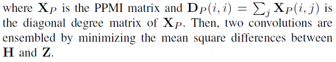

论文提出了一种随机游走抽样方法，以加速过渡概率的计算。实验表明，这种对偶卷积即使对于单图问题也是有效的。

> 【个人小结】
>
> 这一部分主要探索了GCN的对于任意大小Graph的扩展性。

#### 4.1.4 Frameworks

MPNNs[^10]提出了一种在空间域内的统一的图卷积框架，所使用的信息传递函数如下：
$$
\begin{array}{c}
\mathbf{m}_{i}^{l+1}=\sum_{j \in \mathcal{N}(i)} \mathcal{F}^{l}\left(\mathbf{h}_{i}^{l}, \mathbf{h}_{j}^{l}, \mathbf{F}_{i, j}^{E}\right) \\
\mathbf{h}_{i}^{l+1}=\mathcal{G}^{l}\left(\mathbf{h}_{i}^{l}, \mathbf{m}_{i}^{l+1}\right)
\end{array},\tag{19}
$$
这里$\mathcal{F}^l(·)$与$\mathcal{G}^l(·)$分别是信息函数与顶点更新函数，他们需要分别进行训练，$m^l$是节点之间传递的信息。概念上，MPNNs提出了一种框架，每个节点基于它当前的状态传递信息，基于从相邻节点接收到的信息更新自己的信息。除此之外还添加了一个“master”节点来连接其他所有节点，来加速信息传递和提高泛化性。

GraphSAGE[^11]采用了与公式19相似的想法，采用了多种聚合函数：
$$
\begin{aligned}
\mathbf{m}_{i}^{l+1} &=\operatorname{AGGREGATE}^{l}\left(\left\{\mathbf{h}_{j}^{l}, \forall j \in \mathcal{N}(i)\right\}\right) \\
& \mathbf{h}_{i}^{l+1}=\rho\left(\Theta^{l}\left[\mathbf{h}_{i}^{l}, \mathbf{m}_{i}^{l+1}\right]\right)
\end{aligned},\tag{20}
$$
这里，$[·,·]$是连接操作，$AGGREGATE(·)$是聚合函数，作者在这里提出了三种，元素平均element-wise mean，LSTM，max-pooling。max-pooling如下所示：
$$
\text { AGGREGATE }^{l}=\max \left\{\rho\left(\Theta_{\text {pool }} \mathbf{h}_{j}^{l}+\mathbf{b}_{\text {pool }}\right), \forall j \in \mathcal{N}(i)\right\},\tag{21}
$$
上面的$\Theta_{pool}$与$b_{pool}$是需要训练的参数。对于LSTM聚合函数，需要对邻居节点排序，这里使用简单随机顺序。

MoNet[^12]想要通过“模板匹配”将当前的GCNs和CNN领域的工作也整合到一个统一的框架：
$$
h_{i k}^{l+1}=\sum_{j \in \mathcal{N}(i)} \mathcal{F}_{k}^{l}(\mathbf{u}(i, j)) \mathbf{h}_{j}^{l}, k=1, \ldots, f_{l+1},\tag{22}
$$
这里，$\mathbf u(i,j)$是节点对$v_i,v_j$的伪坐标，$\mathcal{F}_k^l(\mathbf u)$是需要训练的参数函数。$h_{ik}^{l}$是$\mathbf{h}_i^l$的第k个维度。换句话说，$\mathcal{F}_k^l(\mathbf u)$在聚合邻居节点的过程中起到了权重的作用。MoNet建议使用建议使用高斯内核：
$$
\mathcal{F}_{k}^{l}(\mathbf{u})=\exp \left(-\frac{1}{2}\left(\mathbf{u}-\boldsymbol{\mu}_{k}^{l}\right)^{T}\left(\boldsymbol{\Sigma}_{k}^{l}\right)^{-1}\left(\mathbf{u}-\boldsymbol{\mu}_{k}^{l}\right)\right),\tag{23}
$$
这里，$\boldsymbol\mu_k^l$是平均向量，$\boldsymbol \Sigma_k^l$是通过训练得到的对角协方差矩阵。

GNs[^13]中提出了一个对于GCNs和GNNs更加普适的框架，来学习三种系列的表示：$\mathbf{h}_j^l,\mathbf{e}_{ij}^l,\mathbf{z}^l$，分别表示节点、边和整个graph。这些表示由以下三种聚合函数和更新函数得到：
$$
\begin{array}{c}
\mathbf{m}_{i}^{l}=\mathcal{G}^{E \rightarrow V}\left(\left\{\mathbf{h}_{j}^{l}, \forall j \in \mathcal{N}(i)\right\}\right) \\
\mathbf{m}_{V}^{l}=\mathcal{G}^{V \rightarrow G}\left(\left\{\mathbf{h}_{i}^{l}, \forall v_{i} \in V\right\}\right) \\
\mathbf{m}_{E}^{l}=\mathcal{G}^{E \rightarrow G}\left(\left\{\mathbf{h}_{i j}^{l}, \forall\left(v_{i}, v_{j}\right) \in E\right\}\right) \\
\mathbf{h}_{i}^{l+1}=\mathcal{F}^{V}\left(\mathbf{m}_{i}^{l}, \mathbf{h}_{i}^{l}, \mathbf{z}^{l}\right) \\
\mathbf{e}_{i j}^{l+1}=\mathcal{F}^{E}\left(\mathbf{e}_{i j}^{l}, \mathbf{h}_{i}^{l}, \mathbf{h}_{j}^{l}, \mathbf{z}^{l}\right) \\
\mathbf{z}^{l+1}=\mathcal{F}^{G}\left(\mathbf{m}_{E}^{l}, \mathbf{m}_{V}^{l}, \mathbf{z}^{l}\right)
\end{array},\tag{25}
$$
这里$\mathcal{F}^V(·),\mathcal{F}^E(·),\mathcal{F}^G(·)$分别是节点、遍和整个graph的相应的更新函数，$\mathcal{G}(·)$是信息传递函数。与MPNNs相比，GNs引入了边的表示与整个Graph的表示，从而使得模型更加普适。

### 4.2 Readout Operations

当面临一些以Graph为整体的任务时，节点信息需要汇聚成一个Graph级别的表示，在一些文献中，这也叫做“Readout Operations”。这一问题的很重要，因为CNNs中的stride convolutions和池化在Graph中无法施展。

**顺序一致性**（order-invariant），即对于一个输入，其中元素的顺序发生变化不影响整体的表示或者意义。例如，当我们使用两个顶点集合之间的一一映射来改变节点和边的索引，Graph此时不应该发生变化。这一问题与判断两个图是否通过类似。这是一个NP问题。

#### 4.2.1 Statistics

最基本的顺序一致性的方法有求和、求平均、最大池化。但这些方法表示能力都较弱。

论文[^14]提出了模糊直方图(fuzzy histogram)。该方法建立多个直方图，将节点的表示形式视为样本，并将它们与一些预定义的模板进行匹配，然后返回最终直方图的拼接。

另一种比较常用的方法是在模型的最后增加一个全连接层：
$$
\mathbf{h}_{G}=\rho\left(\left[\mathbf{H}^{L}\right] \mathbf{\Theta}_{F C}\right)\tag{27}
$$
这里$\left[\mathbf{H}^{L}\right] \in \mathbb{R}^{N f_{L}}$是最后节点表示$\mathbf{H}^L$的联结，$\Theta_{F C} \in \mathbb{R}^{N f_{L} \times f_{\text {output}}}$是参数，$f_{\text {output}}$是输出结果的维度。公式27可以看作节点级特征的加权和。该模型可以为不同的节点学到不同的权重。但缺点是无法保证顺序一致性。

#### 4.2.2 Hierarchical clustering

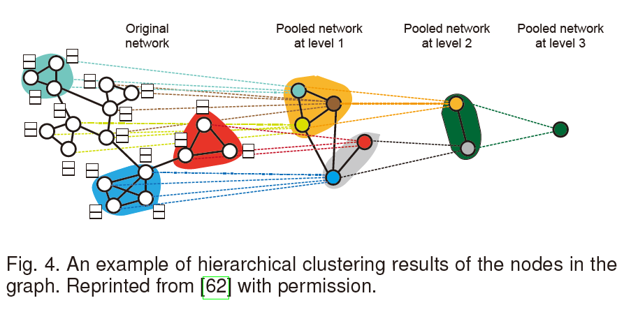

在此之前的 hierarchical clustering 方法都是独立于卷积操作之外，可以在预处理阶段完成，而且不需要端对端的训练。DiffPool[^15]提出了一种与图卷积联合训练的算法。具体地，作者提出在每一层利用隐表示学习一个soft cluster assignment matrix：
$$
\mathbf{S}^{l}=\mathcal{F}\left(\mathbf{A}^{l}, \mathbf{H}^{l}\right)\tag{28}
$$
这里，$\mathbf{S}^{l} \in \mathbb{R}^{N_{l} \times N_{l+1}}$是cluster assignment matrix，$N_l$是第$l$层中聚类的个数，$\mathcal{F}(·)$是要学得的函数。接下来，这个图（这里应该是指通过聚类得到的图）的节点表示和新的邻接矩阵可以通过如下方法得到：
$$
\mathbf{H}^{l+1}=\left(\mathbf{S}^{l}\right)^{T} \hat{\mathbf{H}}^{l+1}, \mathbf{A}^{l+1}=\left(\mathbf{S}^{l}\right)^{T} \mathbf{A}^{l} \mathbf{S}^{l}\tag{29}
$$
这里$\hat{\mathbf H}^{l+1}$通过对$\mathbf H ^l$应用卷积层得到。在每一层做完卷积操作以后，图从$N_l$个节点粗化到$N_{l+1}$个节点。

> 【个人小结】
>
> 私以为 Readout Operations 这一部分对与知识图谱的参考意义不是很大，因为知识图谱更注重于学习图中的节点和边的特征，对于获取整个图的表示需求不强。

### 4.3 Improvements and Discussions

#### 4.3.1 Attention Mechanism

在前面提到的GCNs中，节点的邻域使用相同或预定义的权重进行聚合。然而，邻居的影响可能会有很大的不同，这应该在训练中学习，而不是预先确定的。

GAT[^16]将注意力机制引入到了GCNs之中，对其卷积操作更新为如下：
$$
\mathbf{h}_{i}^{l+1}=\rho\left(\sum_{j \in \hat{\mathcal{N}}(i)} \alpha_{i j}^{l} \mathbf{h}_{j}^{l} \Theta^{l}\right)\tag{30}
$$
这里，$\alpha_{ij}^l$是在第$l$层节点$v_i$对节点$v_j$的注意力，定义为如下形式：
$$
\alpha_{i j}^{l}=\frac{\exp \left(\text { LeakyReLU }\left(\mathcal{F}\left(\mathbf{h}_{i}^{l} \Theta^{l}, \mathbf{h}_{j}^{l} \Theta^{l}\right)\right)\right)}{\sum_{k \in \hat{\mathcal{N}}(i)} \exp \left(\text { LeakyReLU }\left(\mathcal{F}\left(\mathbf{h}_{i}^{l} \Theta^{l}, \mathbf{h}_{k}^{l} \Theta^{l}\right)\right)\right)}\tag{31}
$$
这里$\mathcal{F}(·,·)$是另一个需要学得的函数，例如一个小的连接的网络。作者同时也建议**使用多个相互独立的注意力操作并将结果连接起来，来提高模型的稳定性和表示能力，比如下图中的多头注意力机制（multi-head attention）**。

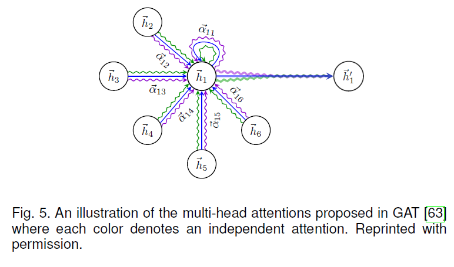

GaAN[^17]在GAT的基础上进一步提出了对于不同的“头”学习不同的权重，并将其应用到交通预测领域。

HAN[^18]针对异构网络提出了两层注意力机制。具体来说，节点级的注意力采用类似于GAT的注意力机制，但是要考虑节点的类型。因此，它可以为节点在聚合基于元路径的邻居时分配权重。然后，语义层次的注意力学习不同元路径的重要性，并输出最终结果。

> 【个人小结】
>
> 这里刚好想起来2019年底阅读GAT时不太理解上图为什么节点之间是有三个注意力的操作，但当时对于GNN和attention机制都不是很熟悉，也去查找了文献《Attention is all you need》。虽然现在仍旧不理解具体是为什么，暂且认为是多做几次能够增强鲁棒性减少误差吧。

#### 4.3.2 Residual and Jumping Connections 剩余连接和跳跃连接

大家的许多工作显示，当前GCNs所支持的模型深度非常有限，一般两到三层。主要原因可能是实际训练过程中的难度或者**过度平滑（over-smoothing）问题**——例如，所有的节点在较深的层中具有相同的表示。

> 【补充】
>
> 之前也遇到过 过度平滑的问题，不是很懂什么是过度平滑，于是搜索了一些参考资料，比如 [如何解决图神经网络中过度平滑的问题][2] ，下面做一些整理。
>
> @纵横 的回答
>
> **不是所有图神经网络都有 over-smooth 的问题**，例如，**基于 RandomWalk + RNN、基于 Attention 的模型大多不会有这个问题**，是可以放心叠深度的～只有部分图卷积神经网络会有该问题。
>
> **不是每个节点的表征都趋向于收敛到同一个值**，更准确的说，是**同一连通分量内的节点的表征会趋向于收敛到同一个值**。这对表征图中不通簇的特征、表征图的特征都有好处。但是，有很多任务的图是连通图，只有一个连通分量，或较少的连通分量，这就导致了节点的表征会趋向于收敛到一个值或几个值的问题。
>
> ……
>
> @superbrother 的回答
>
> **（一）为什么GCN会有过度平滑现象呢？**
>
> 深度学习中的**卷积**本质上是一种**聚合运算**，当卷积核取特定值的时候，就是一种平滑运算。
>
> **（二）CNN的平滑滤波**
>
> 当我们把一个3\*3或者5\*5的卷积核全部取为固定值为$\frac{1}{3}$或者$\frac{1}{5}$的时候，本质上就是**图像里的平滑滤波**。
>
> 为什么CNN的邻域里没有遇到这个问题呢？**原因是卷积核都是parameter learning的，没人专门设置成上述的取值。**
>
> **（三）也许是拉普拉斯矩阵惹的祸**
>
> （大概就是利用拉普拉斯矩阵进行运算时，各个顶点的特征会均匀化了，我理解的是像溶解在这个全连通图中）
>
> **（四）解决**
>
> 作者这里提出了问题出在**卷积核**，所以需要更换或者改进卷积核。

为了解决这一问题，该论文[^3]将剩余连接（Residual Connections，在ResNet[^22]方法中提到）加入到公式13中（即在公式13后又增加一项 $\mathbf{H}^l$ ），结果如下：
$$
\mathbf{H}^{l+1}=\rho\left(\tilde{\mathbf{D}}^{-\frac{1}{2}} \tilde{\mathbf{A}} \tilde{\mathbf{D}}^{-\frac{1}{2}} \mathbf{H}^{l} \Theta^{l}\right)+\mathbf{H}^{l}\tag{32}
$$
实验表明，这一改进的确可以增加网络的深度，与ResNet中的结果相似。

上文提出的Column Network (CLN) [^19]也引入了剩余连接的方法，但增加了可学习的权重。
$$
\mathbf{h}_{i}^{l+1}=\boldsymbol{\alpha}_{i}^{l} \odot \widetilde{\mathbf{h}}_{i}^{l+1}+\left(1-\boldsymbol{\alpha}_{i}^{l}\right) \odot \mathbf{h}_{i}^{l}\tag{33}
$$
这里$\widetilde{\mathbf{h}}_i^{l+1}$的计算方式与公式13相似，$\alpha_i^l$的计算方式如下：
$$
\boldsymbol{\alpha}_{i}^{l}=\rho\left(\mathbf{b}_{\alpha}^{l}+\Theta_{\alpha}^{l} \mathbf{h}_{i}^{l}+\Theta_{\alpha}^{\prime} l_{j \in \mathcal{N}(i)} \mathbf{h}_{j}^{l}\right)\tag{34}
$$
这里$\mathbf{b}_{\alpha}^{l}, \Theta_{\alpha}^{l}, \Theta_{\alpha}^{\prime l}$是参数。

受个性化PageRank启发，该论文[^20]提出的PPNP方法中通过传输到初始层重新定义了图卷积：
$$
\mathbf{H}^{l+1}=(1-\alpha) \tilde{\mathbf{D}}^{-\frac{1}{2}} \tilde{\mathbf{A}} \tilde{\mathbf{D}}^{-\frac{1}{2}} \mathbf{H}^{l}+\alpha \mathbf{H}^{0}\tag{35}
$$
这里$\mathbf{H}^0=\mathcal{F}_\theta(\mathbf{F}^V)$与$\alpha$是一个超参数。所有的参数都在$\mathcal{F}_\theta(\mathbf{F}^V)$中而不是在图卷积中。

该论文提出了Jumping Knowledge Networks (JK-Nets)[^21]提出了另外一种结构来将最后一层神经网络与较低层的神经网络相连。将所有的表示“跳到”最后一层的操作如下图所示：

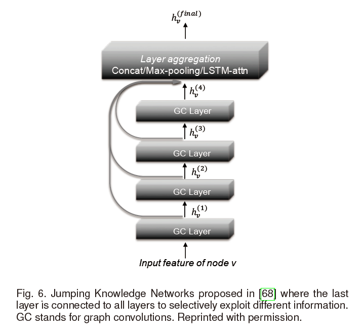

通过这种方式，模型可以有选择性地利用不同层上的信息。JK-Nets的公式如下：
$$
\mathbf{h}_{i}^{\mathrm{final}}=\operatorname{AGGREGATE}\left(\mathbf{h}_{i}^{0}, \mathbf{h}_{i}^{1}, \ldots, \mathbf{h}_{i}^{L}\right)\tag{36}
$$
JK-Nets使用与GraphSAGE[^11]（之前有提到）相同的三个聚合函数：concatenation, max-pooling and LSTM attention。实验表明，增加 jumping connections 可以提高multiple GCN 结构的性能。

> 【个人小结】
>
> 过度平滑是因为在训练过程中，同一个连通图内点的特征随着神经网络层的加深，独有的特征被模糊掉了，点与点之间的差异性小了，可能更多反映的是整个图的特征。此时从最后一层读取输出时，许多节点独有的特征损失掉了。于是，上述第一类方法的思想是在计算每一层时，增加一些先前层的信息（有的是引入了上一层的信息，有的是引入了初始层的信息），并且通过训练得到这两部分信息之间的权重，来解决网络层过深的时候带来的过度平滑问题；第二类方法则，即便在层数过深时会有过度平滑的问题，但仍放任它训练，但在得到最终信息的时候，再回头将所有的层的信息都结合起来，而那一层的信息更重要，则通过训练来为其分配权重。

#### 4.3.3 Edge Features

一种较为直接的方法是对不同种类的边训练不同的参数，并对结果做一个聚合。Neural FPs [^6]对不同度的节点训练不同的参数（主要应用在对于分子的研究领域）。CLN[^23]在异构图中对于不同类型的边训练不同的参数然后平均结果。Edge-Conditioned Convolution (ECC) [^24]也是基于不同类型的边训练不同的参数，并将其应用到了图的分类中。Relational GCNs (R-GCNs)[^25]在知识图谱中也是采用了对不同的关系类型训练得到不同的权重，并添加正则项来减少参数。但是这些方法只能处理有限的离散的边的特征。 

DCNN[^8]提出了一种方法，来将每一条边都转变成连接边的头节点和尾节点的节点，然后，边的特征便可以用获取点特征的方法得到。

与其相似的是，LGCN[^26]建立一个线图（line graph）$B\in\mathbb{R}^{2M\times2M}$来将边特征合并得到：
$$
\mathbf{B}_{i \rightarrow j, i^{\prime} \rightarrow j^{\prime}}=\left\{\begin{array}{ll}
1 & \text { if } j=i^{\prime} \text { and } j^{\prime} \neq i \\
0 & \text { otherwise }
\end{array}\right.\tag{37}
$$
线图中的节点是原图中的有向边，如果信息可以通过它们在原图中的对应边流动，则将线图中的两个节点连接起来。LGCN采用两种GCNs，分别在原图和折线图中。

论文[^14]利用“ 编织模型 weave model ”提出了另一种结构。具体地，它可以同时学到节点跟边的表示，并且利用四个不同的函数在每个编织模型间交换信息：Node-to-Node (NN), Node-to-Edge (NE), Edge-to-Edge (EE) and Edge-to-Node (EN)。

#### 4.3.4 Sampling Methods

对于大规模GCNs的训练，效率是一个瓶颈。如在4.1.4中所述，许多GCNs都是从邻居节点聚合信息。然而，因为许多实数图（real graphs）遵循幂律分布[^27]，比如，节点很少但是节点的度很高，邻居的膨胀速度会非常快。为了解决这一问题，现有两种采样方法：邻居采样和逐层采样，如下图所示：

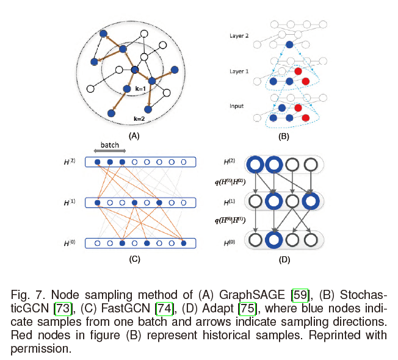

邻居采样这一方法是在计算过程中对每一个节点做采样。GraphSAGE[^11]在训练的过程中，统一地对每一个节点从某一确定数量的邻居节点进行采样。PinSage[^28]提出了利用改进的随机游走的方法对节点的邻居进行采样。StochasticGCN[^29]进一步建议通过使用最后一批的历史激活作为控制变量来减少采样方差，允许任意小的样品量。

FastGCN[^30]提出了一种不同的策略来从每一层卷积层上对节点进行采样，通过将节点解释成独立同分布样本，将图卷积解释为概率度量下的积分变换来进行逐层采样。Adapt[^31]进一步提出了在对较低层的节点进行采样时，以其上面的层为条件，这对于复杂的方差缩减更具有适应性和实用性。

> 为什么要提出使用方差缩减？

#### 4.3.5 Inductive Setting

#### 4.3.6 Theoretical Analysis

以下主要分三部分介绍：关注于节点的任务，关注于图的任务，全面分析，但是对于知识图谱来说，主要涉及到的关注于节点的任务。

##### Node-focused Tasks

论文[^32]首先分析了GCNs的性能，它作为拉普拉斯平滑的一个特殊形式，使得在同一簇内的顶点的特征变得相似。原本的拉普拉斯平滑的公式如下：
$$
\mathbf{h}_{i}^{\prime}=(1-\gamma) \mathbf{h}_{i}+\gamma \sum_{j \in \mathcal{N}(i)} \frac{1}{d_{i}} \mathbf{h}_{j}\tag{39}
$$
$\mathbf{h}_i$和$\mathbf{h}'_i$分别时原始的特征和平滑后的特征。公式39与图卷积的公式12非常相似。基于这一认识，论文提出了在GCN中一种共同训练和一种自训练的方法。

论文[^33]从信号处理的角度对GCN进行了分析。从将节点特征当作是图信号这一理论出发，他们指出公式12基本上一个低通滤波器。基于这一认识，通过移除所有的非线性关系并将学习参数折叠到矩阵中，他们得到了一个非常简化的图卷积（SGC, Simplified Graph Convolution）：
$$
\mathbf{H}^{L}=\left(\tilde{\mathbf{D}}^{-\frac{1}{2}} \tilde{\mathbf{A}} \tilde{\mathbf{D}}^{-\frac{1}{2}}\right)^{L} \mathbf{F}_{V} \Theta\tag{40}
$$
这样的一个“非深度学习”的GCN变体，在许多任务中取得了相似的效果。

论文[^34]证明了低通滤波器的特性使得GCNs不具备非线性流形学习特性，并进一步提出了GFNN，通过在图卷积层之后增加一个多层感知机（MultilayerPerceptron，MLP）来改进上述问题。

## 5~7

略

## 8 Discussion and Conclusion

一些图深度学习领域的开放库：

| Name               | URL                                          | Language/Framework | Key Characteristics                                          |
| ------------------ | -------------------------------------------- | ------------------ | ------------------------------------------------------------ |
| PyTorch Geometric  | https://github.com/rusty1s/pytorch_geometric | PyTorch            | Improved efficiency, unified operations, comprehensive existing methods |
| Deep Graph Library | https://github.com/dmlc/dgl                  | PyTorch            | Improved efficiency, unified operations, large-scale         |
| AliGraph           | https://github.com/alibaba/aligraph          | Unknown            | Distributed, large-scale, in-house algorithms                |
| Euler              | https://github.com/alibaba/euler             | C++/Tensorflow     | Distributed, large-scale                                     |

一些未来的方向：

- 针对还未研究过的图提出新的模型

- 对现有的模型进行组合

- 动态图 Dynamic graphs

  如何对动态图的演化特征进行建模，并支持模型参数的增量更新，在很大程度上还是一个有待解决的问题。一些初步的工作尝试使用图RNN架构来解决这个问题，并取得了令人鼓舞的结果。[^35][^36]

- 可解释性与鲁棒性

[1]: https://www.zhihu.com/question/54504471/answer/332657604	"从CNN到GCN的联系与区别——GCN从入门到精（fang）通（qi）"
[2]: https://www.zhihu.com/question/346942899	"如何解决图神经网络中过度平滑的问题？"
[ 3]:https://zhuanlan.zhihu.com/p/85287578	"拉普拉斯矩阵与拉普拉斯算子的关系"

[^1]: J. Bruna, W. Zaremba, A. Szlam, and Y. Lecun, “Spectral networks and locally connected networks on graphs,” in Proceedings of the 3rd International Conference on Learning Representations, 2014.
[^2]: M. Defferrard, X. Bresson, and P. Vandergheynst, “Convolutional neural networks on graphs with fast localized spectral filtering,” in Advances in Neural Information Processing Systems, 2016, pp. 3844–3852.
[^3]: T. N. Kipf and M. Welling, “Semi-supervised classification with graph convolutional networks,” in Proceedings of the 6th International Conference on Learning Representations, 2017.
[^4]: R. Levie, F. Monti, X. Bresson, and M. M. Bronstein, “Cayleynets: Graph convolutional neural networks with complex rational spectral filters,” IEEE Transactions on Signal Processing, vol. 67, no. 1, pp. 97–109, 2017.
[^5]: B*. Xu, H. Shen, Q. Cao, Y. Qiu, and X. Cheng, “Graph wavelet neural network,” in Proceedings of the 8th International Conference on Learning Representations, 2019.
[^6]: D. K. Duvenaud, D. Maclaurin, J. Iparraguirre, R. Bombarell, T. Hirzel, A. Aspuru-Guzik, and R. P. Adams, “Convolutional networks on graphs for learning molecular fingerprints,” in Advances in Neural Information Processing Systems, 2015, pp. 2224–2232.
[^7]: M. Niepert, M. Ahmed, and K. Kutzkov, “Learning convolutionalneural networks for graphs,” in International Conference on Machine Learning, 2016, pp. 2014–2023.
[^8]: J. Atwood and D. Towsley, “Diffusion-convolutional neural networks,” in Advances in Neural Information Processing Systems, 2016.
[^9]: C. Zhuang and Q. Ma, “Dual graph convolutional networks for graphbased semi-supervised classification,” in Proceedings of the 2018 World Wide Web Conference, 2018, pp. 499–508.
[^10]: J. Gilmer, S. S. Schoenholz, P. F. Riley, O. Vinyals, and G. E. Dahl, “Neural message passing for quantum chemistry,” in International Conference on Machine Learning, 2017, pp. 1263–1272
[^11]: W. Hamilton, Z. Ying, and J. Leskovec, “Inductive representation learning on large graphs,” in Advances in Neural Information Processing Systems, 2017, pp. 1024–1034.
[^12]: F. Monti, D. Boscaini, J. Masci, E. Rodola, J. Svoboda, and M. M. Bronstein, “Geometric deep learning on graphs and manifolds using mixture model cnns,” in Proceedings of Computer Vision and Pattern Recognition, vol. 1, no. 2, 2017, p. 3.
[^13]: P. W. Battaglia, J. B. Hamrick, V. Bapst, A. Sanchez-Gonzalez, V. Zambaldi, M. Malinowski, A. Tacchetti, D. Raposo, A. Santoro, R. Faulkner, C. Gulcehre, F. Song, A. Ballard, J. Gilmer, G. Dahl, A. Vaswani, K. Allen, C. Nash, V. Langston, C. Dyer, N. Heess, D. Wierstra, P. Kohli, M. Botvinick, O. Vinyals, Y. Li, and R. Pascanu, “Relational inductive biases, deep learning, and graph networks,” arXiv preprint arXiv:1806.01261, 2018.
[^14]: S. Kearnes, K. McCloskey, M. Berndl, V. Pande, and P. Riley, “Molecular graph convolutions: moving beyond fingerprints,” Journal of Computer-Aided Molecular Design, vol. 30, no. 8, pp. 595–608, 2016.
[^15]: R. Ying, J. You, C. Morris, X. Ren, W. L. Hamilton, and J. Leskovec, “Hierarchical graph representation learning with differentiable pooling,” in Advances in Neural Information Processing Systems, 2018.
[^16]: P. Velickovic, G. Cucurull, A. Casanova, A. Romero, P. Lio, and Y. Bengio, “Graph attention networks,” in Proceedings of the 7th International Conference on Learning Representations, 2018.
[^17]: J. Zhang, X. Shi, J. Xie, H. Ma, I. King, and D.-Y. Yeung, “Gaan:Gated attention networks for learning on large and spatiotemporalgraphs,” in Proceedings of the Thirty-Fourth Conference on Uncertaintyin Artificial Intelligence, 2018.
[^18]: X. Wang, H. Ji, C. Shi, B. Wang, Y. Ye, P. Cui, and P. S. Yu, “Heterogeneous graph attention network,” in The World Wide Web Conference. ACM, 2019, pp. 2022–2032.
[^19]: T. Pham, T. Tran, D. Q. Phung, and S. Venkatesh, “Column networks for collective classification.” in Proceedings of the 31st AAAI Conference on Artificial Intelligence, 2017, pp. 2485–2491.
[^20]: J. Klicpera, A. Bojchevski, and S. G¨unnemann, “Predict then propagate: Graph neural networks meet personalized pagerank,” in Proceedings of the 8th International Conference on Learning Representations, 2019.
[^21]: K. Xu, C. Li, Y. Tian, T. Sonobe, K.-i. Kawarabayashi, and S. Jegelka, “Representation learning on graphs with jumping knowledge networks,” in International Conference on Machine Learning, 2018.
[^22]:  K. He, X. Zhang, S. Ren, and J. Sun, “Deep residual learning for image recognition,” in Proceedings of the IEEE conference on Computer Vision and Pattern Recognition, 2016, pp. 770–778.

[^23]:T. Pham, T. Tran, D. Q. Phung, and S. Venkatesh, “Column networks for collective classification.” in Proceedings of the 31st AAAI Conference on Artificial Intelligence, 2017, pp. 2485–2491.
[^24]:M. Simonovsky and N. Komodakis, “Dynamic edgeconditioned filters in convolutional neural networks on graphs,” in 2017 IEEE Conference on Computer Vision and Pattern Recognition (CVPR), 2017.
[^25]:M. Schlichtkrull, T. N. Kipf, P. Bloem, R. V. D. Berg, I. Titov, and M. Welling, “Modeling relational data with graph convolutional networks,” in European Semantic Web Conference. Springer, 2018, pp. 593–607.
[^26]: Z. Chen, L. Li, and J. Bruna, “Supervised community detection with line graph neural networks,” in Proceedings of the 8th International Conference on Learning Representations, 2019.
[^27]: A.-L. Barab´asi and R. Albert, “Emergence of scaling in random networks,” Science, vol. 286, no. 5439, pp. 509–512, 1999.
[^28]: R. Ying, R. He, K. Chen, P. Eksombatchai, W. L. Hamilton, and J. Leskovec, “Graph convolutional neural networks for web-scale recommender systems,” in Proceedings of the 24th ACM SIGKDD International Conference on Knowledge Discovery and Data Mining, 2018.
[^29]: J. Chen, J. Zhu, and L. Song, “Stochastic training of graph convolutional networks with variance reduction,” in International Conference on Machine Learning, 2018, pp. 941–949.
[^30]: J. Chen, T. Ma, and C. Xiao, “Fastgcn: fast learning with graph convolutional networks via importance sampling,” in Proceedings of the 7th International Conference on Learning Representations, 2018.
[^31]: W. Huang, T. Zhang, Y. Rong, and J. Huang, “Adaptive sampling towards fast graph representation learning,” in Advances in Neural Information Processing Systems, 2018, pp. 4563–4572.
[^32]: Q. Li, Z. Han, and X.-M. Wu, “Deeper insights into graph convolutional networks for semi-supervised learning,” in Proceedings of the Thirty- Second AAAI Conference on Artificial Intelligence, 2018.
[^33]: F. Wu, A. Souza, T. Zhang, C. Fifty, T. Yu, and K. Weinberger, “Simplifying graph convolutional networks,” in International Conference on Machine Learning, 2019, pp. 6861–6871.
[^34]: T. Maehara, “Revisiting graph neural networks: All we have is low-pass filters,” arXiv preprint arXiv:1905.09550, 2019.
[^35]: Y. Ma, Z. Guo, Z. Ren, E. Zhao, J. Tang, and D. Yin, “Dynamic graph neural networks,” arXiv preprint arXiv:1810.10627, 2018.
[^36]: F. Manessi, A. Rozza, and M. Manzo, “Dynamic graph convolutional networks,” arXiv preprint arXiv:1704.06199, 2017.