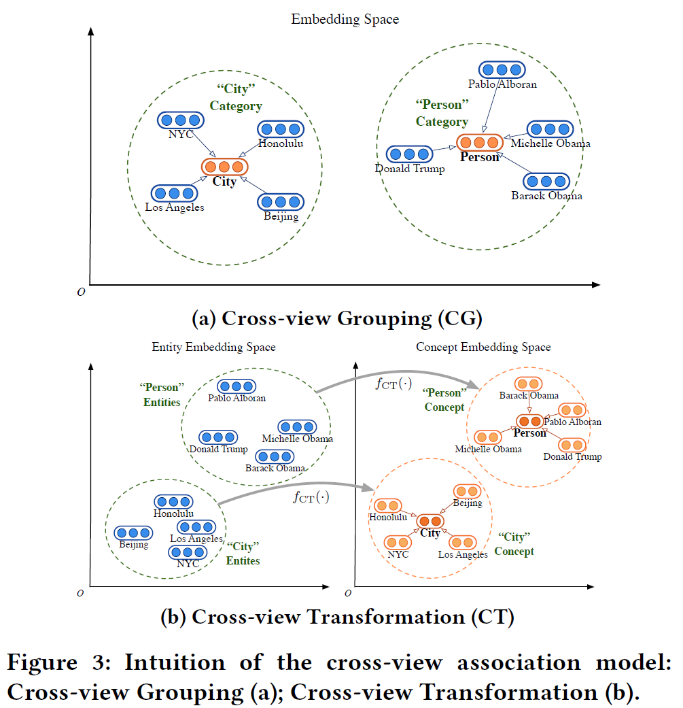

# Universal Representation Learning of Knowledge Bases by Jointly Embedding Instances and Ontological Concepts

## 1 引言

In this paper, they propose a novel two-view KG embedding model, $JOIE$, with the goal to produce better knowledge embedding and enable new applications that rely on multi-view knowledge. $JOIE$ use cross-view and intra-view modeling.


下图展示了实体图谱与本体图谱之间的关系


$JOIE$ contains two components:

1. a cross-view association model is designed to associate the instance embedding to its corresponding concept embedding.
2. the intra-view embedding model characterizes the relational facts of ontology and instance views in **two separate embedding spaces**.


cross-view grouping 技术保证了当前的两种view（视图、视角）能够进入到相同的表示空间，因为cross-view转换技术提供了一种从实体表示空间到本体表示空间的非线性变换。

而在 intra-view embedding model 中，使用了三种 trans 类型的表示学习技术，从而得到每个视图的多关系结构的表示。


## 2 建模


### 2.1 Cross-view Association Model

目的：to capture the associations between the entity embedding space and the concept embedding space, based on the cross-view links in KBs, which will be their key contributions.

#### Cross-view Grouping (CG)

The cross-view grouping method can be considered as grouping-based regularization, which assumes that the ontology-view KG and instance-view KG can be embedded into the same space, and **(!!! following thing is important)** forces any instance $e \in \mathcal{E}$ to be close to its corresponding concept $c \in \mathcal{C}$，如图3(a)所示。便可以根据这一目标设计 Loss Function，同时这也便要求 instance-view 与 ontology-view 的表示向量维度相同。

Loss：
$$
J_{\mathrm{Cross}}^{\mathrm{CG}}=\frac{1}{|\mathcal{S}|} \sum_{(e, c) \in \mathcal{S}}\left[\|\mathbf{c}-\mathbf{e}\|_{2}-\gamma^{\mathrm{CG}}\right]_{+} \tag{1}
$$
这里的$[x]_+$与 $TransE$ 中的类似，$[x]_+=max\{x, 0\}$，这一设计使得实体的向量表示$e$落在了半径为 $\gamma^{\mathrm{CG}}$ 大小的圆内。最终实体以本体为中心形成一种聚类的效果。



#### Cross-view Transformation (CT)

与CG不同的是，CT允许实体向量表示空间与本体向量表示空间不相同。如图3(b)所示，显然图中的 $f_{CT}(·)$ 是变换函数，即： 


$$
\mathbf{c} \leftarrow f_{\mathrm{CT}}(\mathbf{e}), \forall(e, c) \in \mathcal{S} \tag{2}
$$

这里 $f_{\mathrm{CT}}(\mathbf{e})=\sigma\left(\mathbf{W}_{\mathrm{ct}} \cdot \mathbf{e}+\mathbf{b}_{\mathrm{ct}}\right)$ 是一个非线性防射变换。$\mathbf{W}_{\mathrm{ct}}$ 是一个权值矩阵，$\sigma(·)$ 用的是 $tanh$ 。
$$
J_{\mathrm{Cross}}^{\mathrm{CT}}=\frac{1}{|\mathcal{S}|} \sum_{(e, c) \in \mathcal{S} \and (e, c') \notin S}\left[\gamma^{\mathrm{CT}}+\left\|\mathbf{c}-f_{\mathrm{CT}}(\mathbf{e})\right\|_{2}-\left\|\mathbf{c}^{\prime}-f_{\mathrm{CT}}(\mathbf{e})\right\|_{2}\right]_{+} \tag{3}
$$


### 2.2 Intra-view Model

目的： The aim of intra-view model is to preserve the original structural information in each view of the KB **separately** in two embedding spaces.

#### Default Intra-view Model

这里可以使用比较常用的知识图谱表示学习的方法。

adopt three representative techniques: translations, multiplications, circular correlation.

score functions:
$$
\begin{aligned}
f_{\text {TransE }}(\mathbf{h}, \mathbf{r}, \mathbf{t}) &=-\|\mathbf{h}+\mathbf{r}-\mathbf{t}\|_{2} \\
f_{\text {Mult }}(\mathbf{h}, \mathbf{r}, \mathbf{t}) &=(\mathbf{h} \circ \mathbf{t}) \cdot \mathbf{r} \\
f_{\text {HolE }}(\mathbf{h}, \mathbf{r}, \mathbf{t}) &=(\mathbf{h} \star \mathbf{t}) \cdot \mathbf{r}
\end{aligned} \tag{4}
$$
loss function:
$$
J_{\text {Intra }}^{\mathcal{G}}=\frac{1}{|\mathcal{G}|} \sum_{(h, r, t) \in \mathcal{G} \and (h',r,t')\notin \mathcal{G}}\left[\gamma^{\mathcal{G}}+f\left(\mathbf{h}^{\prime}, \mathbf{r}, \mathbf{t}^{\prime}\right)-f(\mathbf{h}, \mathbf{r}, \mathbf{t})\right]_{+} \tag{5}
$$
$\gamma^\mathcal{G} > 0$ 是一个 positive margin，$(h', r, t')$ 是负采样，要么是换掉了头实体、要么换掉了尾实体，要么是不在$\mathcal{G}$里面的关系。

上面提到方法即可以在 instance-view graph 上使用，也可以在 ontology-view graph 上使用。对于两种view可以分别得到他们的 loss，$J^{\mathcal{G}_I}_{Intra}$ 和 $J^{\mathcal{G_O}}_{Intra}$，得到如下联合loss：
$$
J_{Intra} = J^{G_I}_{Intra} + \alpha_1 \cdot J^{G_O}_{Intra} \tag{6}
$$

#### Hierarchy-Aware Intra-view Model for the Ontology

ontology-view graph 会有一定的层次结构，或者说是由一些meta-relation（比如 subclass_of，is_a）构成的层次化属性。这种meta-relation在ontology-view graph种出现的频率非常高，比如：

```
musician -> is_a -> artist
singer -> is_a -> artist
artist -> is_a -> person
```

给定概念对($c_l$, $c_h$)，我们将这样的层次模型化为粗概念和相关的细概念之间的非线性转换：（或者可以说是抽象概念与具体概念之间的非线性转换“$(musician, "subclass\_of", artist)$” ）
$$
g_{\mathrm{HA}}\left(\mathrm{c}_{h}\right)=\sigma\left(\mathrm{W}_{\mathrm{HA}} \cdot \mathrm{c}_{l}+\mathrm{b}_{\mathrm{HA}}\right) \tag{7}
$$

这将引入一个新的损失，本体视图中的本体层次损失。

同时也在ontology-view的loss中引入了一个新的loss项——ontology hierarchy loss：
$$
J_{\mathrm{Intra}}^{\mathrm{HA}}=\frac{1}{|\mathcal{T}|} \sum_{\left(c_{l}, c_{h}\right) \in \mathcal{T} \and (c_l, c_h') \notin \mathcal{T}}\left[\gamma^{\mathrm{HA}}+\left\|\mathrm{c}_{h}-g\left(\mathrm{c}_{l}\right)\right\|_{2}-\left\|\mathrm{c}_{\mathrm{h}}^{\prime}-g\left(\mathrm{c}_{\mathrm{l}}\right)\right\|_{2}\right]_{+}\tag{8}
$$
所以intra-view的总的loss函数为：
$$
J_{\text {Intra }}=J_{\text {Intra }}^{\mathcal{G}_{I}}+\alpha_{1} \cdot J_{\text {Intra }}^{\mathcal{G}_O \backslash \mathcal{T}}+\alpha_{2} \cdot J_{\text {Intra }}^{\mathrm{HA}} \tag{9}
$$
这里的

### 2.3 在两个视图上进行联合训练

联合的损失函数为：
$$
J=J_{\text {Intra }}+\omega \cdot J_{\text {Cross }} \tag{10}
$$

## 3 实验