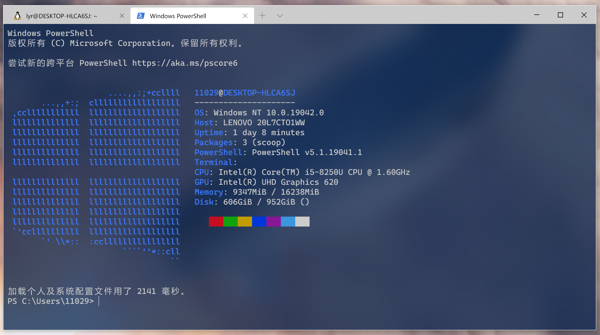

# 如何在Windows中打印Linux中的Screenfetch信息？

熟悉Linux的朋友都知道，在Linux系统下，有一些打印Screenfetch的命令。比如我比较常用的是 ```neofetch```，在Ubuntu下的效果如下图：


那么在Windows的powershell下如何实现这样的效果呢？

**步骤一：**以管理员身份运行powershell

**步骤二：**在powershell中输入：

```powershell
Set-ExecutionPolicy RemoteSigned -scope CurrentUser
```

**步骤三：**继续输入：

```powershell
Invoke-Expression (New-Object System.Net.WebClient).DownloadString('https://get.scoop.sh')
```

**步骤四：**继续输入：

```powershell
scoop install git
```

这一步执行过程中，除了git还会下载7zip，我第一次的时候7zip下载失败了，导致后面一直报错，uninstall 以后重装一下7zip就可以了。

**步骤五：**继续输入：

```powershell
scoop bucket add extras
scoop install winfetch
```

这一步执行完以后，就可以直接敲winfetch命令看结果了。

如果不想设置为开启powershell自动打印，到这里配置就结束了，如果想要自动打印，后面还有两步。

**步骤六：**继续输入：

```powershell
New-Item $profile -Type File -Force
```

这一步执行完以后，会创建一个新的文件，位于```Documents\WindowsPowerShell\Microsoft.PowerShell_profile```

**步骤七：**打开该文件，在里面添加一行：

```
winfetch
```

即可让powershell在启动时自动执行 ```winfetch``` 。

这就是所有的操作了，效果如下：




上述操作参考了 [Matthew Moore](https://www.youtube.com/channel/UCVTlmFfclZsEj_Wo5P_3YRQ) 的视频：

https://www.youtube.com/watch?v=F2emssKgxR0