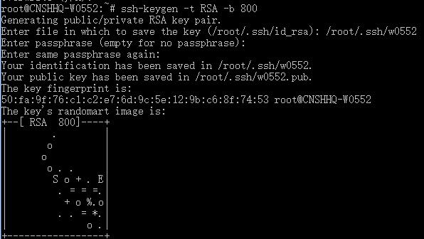
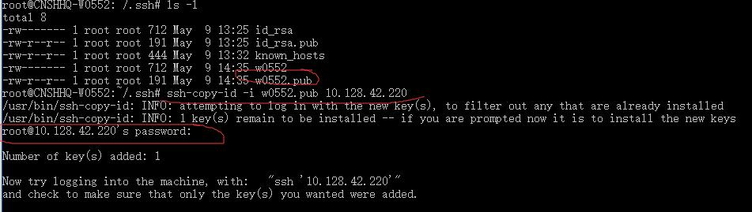
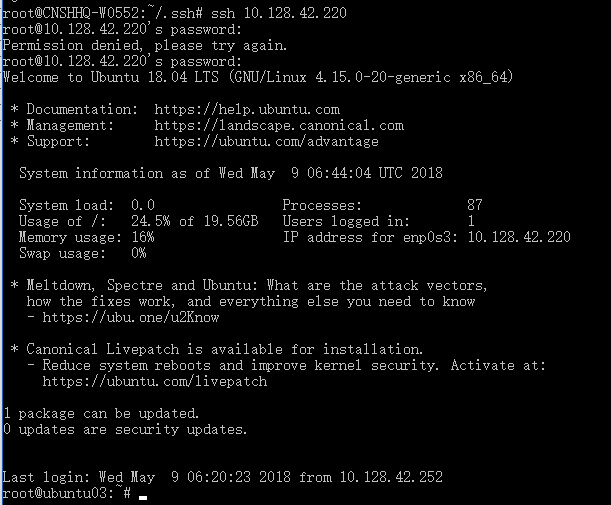

##### 第一步 先在本地生成公钥

```
ssh-keygen -t RSA -b 800   
```



也可以直接输入：`ssh-keygen` 然后一路回车

##### 第二步 进入到.ssh文件夹下

```
cd /root/.ssh
```

##### 第三步 将本地的公钥发送到远程服务器

```
ssh-copy-id -i id_rsa.pub [远程服务器IP]
```



这一步需要输入远程服务器的root密码

##### 第四步 测试登录远程服务器



 

搞定 ！！ 