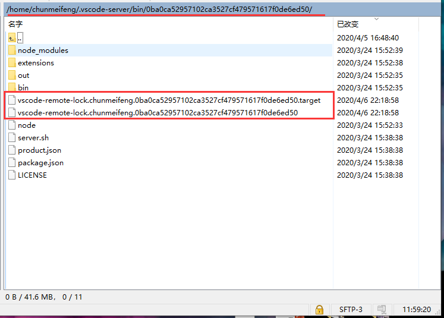

几天没使用VS Code远程连接服务器，连接时报错如下：

```bash
[22:19:47.087] > b8aafe7c10e7: running
> 
[22:19:47.200] > Acquiring lock on /home/yzy/.vscode-server-insiders/bin/b53d3c26f35df3da2d3f2ed472e73c8edf4f90d0/vscode-remote-lock.yzy.b53d3c26f35df3da2d3f2ed472e73c8edf4f90d0
> 
[22:19:47.211] > \ln /home/yzy/.vscode-server-insiders/bin/b53d3c26f35df3da2d3f2ed472e73c8edf4f90d0/vscode-remote-lock.yzy.b53d3c26f35df3da2d3f2ed472e73c8edf4f90d0.target /home/yzy/.vscode-server-insiders/bin/b53d3c26f35
> df3da2d3f2ed472e73c8edf4f90d0/vscode-remote-lock.yzy.b53d3c26f35df3da2d3f2ed472e73c8edf4f90d0
> ln: failed to create hard link'/home/yzy/.vscode-server-insiders/bin/b53d3c26f35df3da2d3f2ed472e73c8edf4f90d0/vscode-remote-lock.yzy.b53d3c26f35df3da2d3f2ed472e73c8edf4f90d0'Installation already in progress...   
> b8aafe7c10e7##24##
> : File exists
> 
[22:19:47.212] Received install output: b8aafe7c10e7##24##
[22:19:47.212] Server installation process already in progress - waiting and retrying
[22:19:47.614] "install" terminal command done
[22:19:47.614] Install terminal quit with output: 
[22:33:14.177] getPlatformForHost was canceled
[22:33:14.179] Resolver error: Connecting was canceled
[22:33:14.186] -----
```

参考[链接](https://github.com/microsoft/vscode-remote-release/issues/2507)，解决方案是删除对应硬链接（上图第一段标绿链接）下的同名文件与同名target文件，如下红框部分（图示服务器不同，所以路径有所区别）：



删除后报错得到解决。