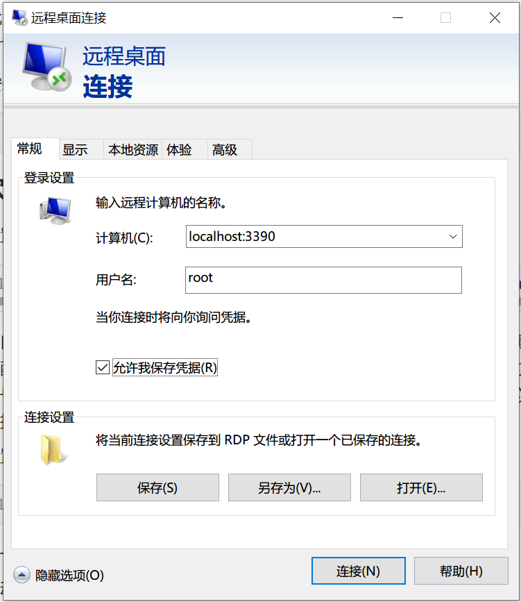
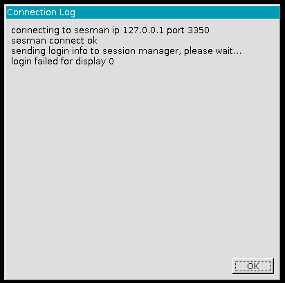
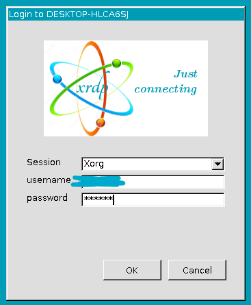
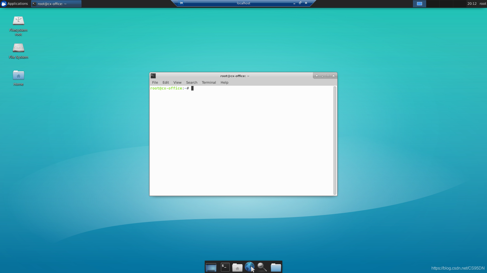
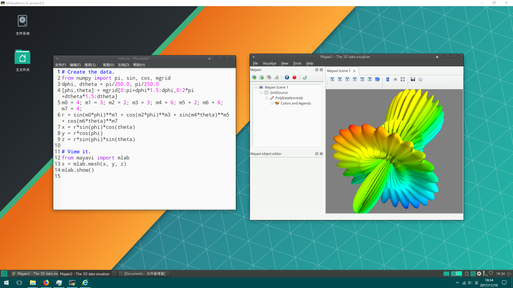

# WSL中配置Linux可视化界面

### 0. 准备工作

我使用的是Windows应用商店中的 Ubuntu 18.04 LTS，安装完成以后，为了提高软件包下载速度，一般是要把软件库更换成清华开源镜像：[Ubuntu清华开源镜像](https://mirror.tuna.tsinghua.edu.cn/help/ubuntu/)。

更换好以后，先执行下面的命令，更新apt：

```bash
$ sudo apt update
$ sudo apt upgrade
```

### 1. 安装图形化界面

这里使用的是xfce4，安装命令为：

```bash
$ sudo apt install xfce4
```

它的优点主要是占用空间小，此外该界面主要是有一个图形界面可以使用spacemacs。

然后安装xrdp：

```shell
$ sudo apt install xrdp
```

### 2. 软件配置

- 配置xrdp端口

  ```shell
  $ sudo sed -i 's/port=3389/port=3390/g' /etc/xrdp/xrdp.ini
  ```

  端口号要记住，后面从windows进行连接的时候要用到。这里面 3389 是默认配置，这里将其改为 3390 是避免和 windows 的端口冲突。因为两边的端口号是通的，在 wsl 中开一个 8080 端口的 WebServer，在 windows 可以直接访问。

- 配置xsession

  ```shell
  $ sudo echo xfce4-session >~/.xsession
  ```

  这一步其实是在告诉系统，开启桌面环境的时候开启什么桌面环境。

- 启动 xrdp

  ```shell
  $ sudo service xrdp restart
  ```

### 3. Windows远程连接

打开Windows中的“远程桌面连接” （快捷方式是 win+r 输入“mstsc”）

在计算机名的地方输入本地的3390端口，用户名输入root，如下图：



进入以后会显示一个小的对话框：



这个时候点击“ok”，会弹出填写用户名和密码的对话框，填写对应的用户名和密码：



点击OK即可登录到可视化界面：



如果WSL的Ubuntu系统关闭，如关机重启，会导致远程连接不上，此时需要先在Win10中打开Ubuntu的命令行界面，输入：

```shell
$ sudo service xrdp restart
```

此时再远程连接，即可连接上。

### 4. 尾声

后续还看到一个特别牛批的大神做的：[WSL使用小结：从ArchLinux到Manjaro](https://www.cnblogs.com/wurui1994/p/7839777.html)，以及知乎的问题：[Deepin Linux上架WSL要多久?](https://www.zhihu.com/question/355179099)，知乎文章：[利用WSL打造Arch开发环境](https://zhuanlan.zhihu.com/p/51270874)



后续可以继续折腾。

### 5. 参考资料

1. [WSL使用图形界面（ubuntu）](https://blog.csdn.net/cs95dn/article/details/93224607)

2. [WSL-Ubuntu 安装Xubuntu-Desktop 记录](https://www.cnblogs.com/iblackly/p/11740807.html)