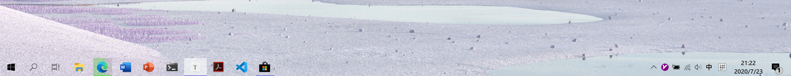

# Windows10 美化工具

当前的我的Win10的版本号为20H2

### 1. MacType

这是一个在Windows系统中渲染出类似于MacOS中字体的感觉的工具，里面提供了很多种字体可以选择。对于使用windows高分屏的朋友来说这个工具非常好用。

GitHub地址： https://github.com/snowie2000/mactype

官方地址： https://www.mactype.net/

### 2. TaskBar Control

这个软件提供了一个快捷显示和隐藏Windows下方任务栏的热键，可以自己定制。

具体下载可以直接在Google中搜索TaskBar Control

### 3. TransLucentTB

这个是在Windows应用商店下载，它的用途也是美化任务栏，可以提供透明，毛玻璃和不透明多种模式。

好啦，我现在在用的就是这么三款插件，在此还要感谢知乎回答：https://www.zhihu.com/collection/552662635