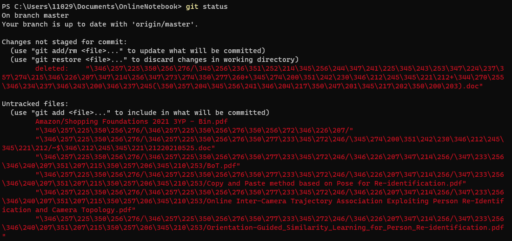
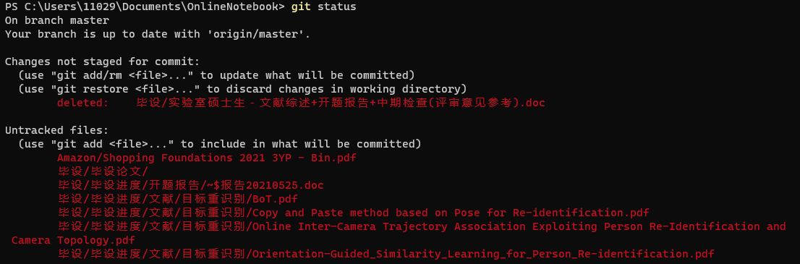

## 解决git命令在终端中显示乱码的问题

例如：



**原因：**

在默认设置下，中文文件名在工作区状态输出，中文名不能正确显示，而是显示为八进制的字符编码。

**解决办法：**

将git配置文件 `core.quotepath`项设置为`false`。`quotepath`表示引用路径，加上`--global`表示全局配置

`git bash`终端输入命令：

```text
git config --global core.quotepath false
```

解决以后：



